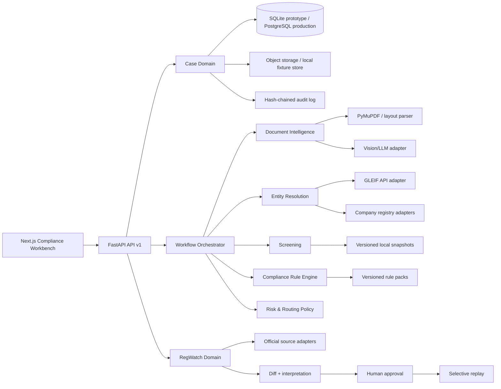
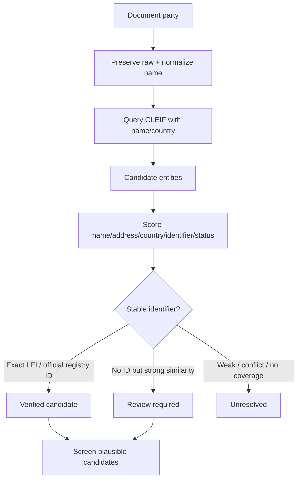
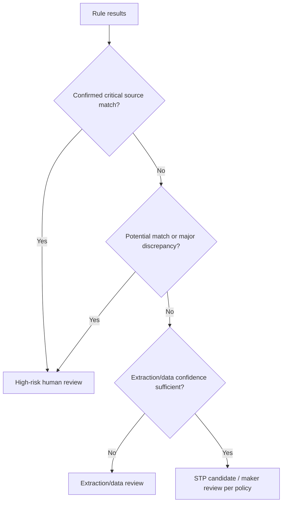
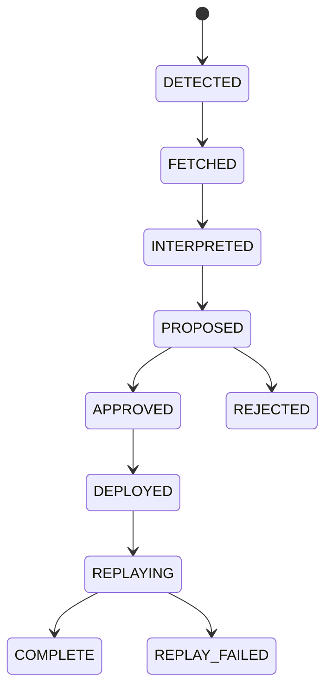
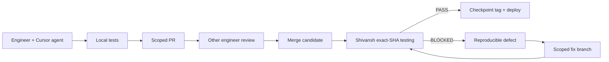

# TradePulse AI
## Product Requirements Document — Comprehensive Hackathon Edition

**Product:** TradePulse AI — Cross-Border Trade Compliance Decisioning Platform  
**Program:** GIFT IFIH Young Builders’ Program Hackathon 2026  
**Theme:** Agentic AI in Financial Services  
**Focus area:** Fraud, Risk & Compliance  
**Version:** 3.0 — role-corrected consolidated PRD  
**Document owner:** TradePulse team  
**Product & Compliance Workbench Engineer:** Ansh  
**Platform & Intelligence Engineer:** Abhishek  
**QA / release gatekeeper:** Shivansh  
**Target build:** 22-hour hackathon prototype  
**Document classification:** Sensitive compliance software requirements; prototype only  

> **Critical disclaimer:** This prototype is not authorised to approve transactions, release funds, block customers, make definitive sanctions determinations, provide legal advice, or replace regulated compliance staff. It uses synthetic trade cases and selected public reference data. Every adverse or uncertain result is a human-review recommendation.

---

# 1. Executive Summary

TradePulse AI is an API-first trade-compliance decisioning workbench for banks, trade houses and exporters operating through cross-border corridors connected to GIFT IFSC.

A trade-finance presentation commonly contains an invoice, bill of lading, packing list and sometimes a letter of credit. A compliance officer must establish that the parties are real and correctly identified, the documents agree with one another, the goods and shipment are permissible, the declared prices are plausible, and no party or vessel appears on relevant sanctions or export-control lists.

Today, this work is fragmented and document-heavy. TradePulse creates a structured, evidence-backed case from those documents. Its three core product phases are:

1. **Document Intelligence Extraction** — turn unstructured documents into validated fields with confidence and page-level provenance.
2. **Compliance Decision Engine** — apply versioned rules for identity, sanctions, document consistency, TBML price indicators, goods, duplicate presentations and LC requirements.
3. **RegWatch Change Engine** — monitor authoritative data and regulatory sources, detect changes, propose versioned rule updates, require human approval, and replay affected cases.

The important product distinction is that TradePulse is **not an AI PDF parser**. It is a controlled decision-support platform with:

- A compliance workbench rather than a generic dashboard.
- A rules-as-data engine rather than hidden prompt logic.
- Entity resolution rather than exact-name matching.
- Evidence and provenance rather than unexplained scores.
- Maker-checker workflow rather than autonomous approval.
- Versioned public data snapshots rather than unverifiable live lookups.
- Regulatory change management rather than a point-in-time check.

### Product thesis

> **TradePulse makes the needle glow: it helps a compliance officer find, understand and defend the important discrepancies without pretending that an AI model is the decision-maker.**

---

# 2. Hackathon Context and Constraints

The event brief states that the project is a 22-hour build sprint beginning at 2:00 PM on Friday, 21 August 2026, with judging based on technical execution and architecture (30%), founder/venture assessment (30%), problem depth and regulatory realism (20%), and honesty/roadmap credibility (20%). It also states that no real banking data will be supplied and teams must arrive with a synthetic-data strategy. [file:167]

The brief further states that code must start clean at the event kickoff and that pre-built repositories are not permitted; therefore, reusable preparation should consist of architecture, specifications, environment setup, source research and data-generation plans rather than a pre-built application repository. [file:167]

### 2.1 Hard constraints

- 22 hours of implementation time.
- **Ansh:** Product and Compliance Workbench Engineer.
- **Abhishek:** Platform and Intelligence Engineer.
- **Shivansh:** Independent QA and Release Engineer.
- Cursor and coding agents will be used by all team members.
- Public reference data may be downloaded where permitted.
- Trade documents and banking workflow records must be synthetic.
- The product must remain demonstrable if internet or an external model fails.
- Every pushed increment must be tested by Shivansh.
- Every release must be reversible to a known-good commit.

### 2.2 Implications

- Build a modular monolith, not distributed microservices.
- Freeze API and domain contracts early.
- Build frontend and backend in parallel against mock fixtures.
- Prioritise one complete golden path over many partial features.
- Use real public sources for credibility, but cache snapshots for reliability.
- Label live, cached, synthetic, planned and unavailable data distinctly.
- Keep AI agent autonomy bounded by explicit file scopes and acceptance tests.

---

# 3. Vision, Mission and Positioning

## 3.1 Vision

TradePulse becomes the trusted compliance middleware through which cross-border trade presentations are examined before a regulated institution makes a human decision.

## 3.2 Mission

Reduce avoidable manual effort and working-capital delays while improving the quality, consistency and auditability of trade-compliance review.

## 3.3 One-sentence pitch

> TradePulse is an explainable trade-compliance workbench that reads a complete trade presentation, resolves counterparties, checks documents and prices against versioned reference data, and routes evidence-backed discrepancies to the right human reviewer.

## 3.4 Layman explanation

> International trade works on paperwork. An exporter gives a bank an invoice saying what was sold, a shipping document saying what was carried, and other forms describing the transaction. The bank has to check whether all those papers agree and whether the buyer, seller and price look legitimate. TradePulse is like spell-check for those documents: it does not accuse anyone or make the final decision, but it finds inconsistencies and shows the officer exactly where to look.

## 3.5 Position against generic OCR

| Generic OCR tool | TradePulse |
|---|---|
| Extracts text | Extracts facts with confidence, coordinates and evidence |
| Returns a document | Creates a compliance case |
| Exact string search | Multi-attribute entity resolution |
| One-time processing | Versioned rules and reference data |
| Black-box “risk score” | Per-rule explanation and source provenance |
| AI output | Human maker-checker workflow |
| Static result | RegWatch-triggered selective replay |
| No operational context | Queue, SLA, ownership, audit and KPI surface |

---

# 4. Problem Definition

## 4.1 Primary problem

Trade-compliance teams must make high-consequence decisions using fragmented, scanned or unstructured documents and multiple changing external data sources. Manual review is slow, inconsistent and difficult to audit at scale.

## 4.2 Problem examples

### Example A — Similar counterparty names

A document names `Amit TRD Co.`. A registry may contain `Amit Trading Company Private Limited`. A tired reviewer may miss the relationship, or may incorrectly treat a different company as the same company.

TradePulse should:

- Preserve the original name.
- Normalize abbreviations only for retrieval.
- Search credible registries such as GLEIF.
- Compare name, address, country, registration ID and LEI.
- Present candidates rather than silently choosing one.
- Route strong-but-unverified similarity to manual review.
- Screen plausible candidates against sanctions data.

A similarity score is a **candidate signal**, not identity proof and not a sanctions conclusion.

### Example B — Cross-document mismatch

The invoice says 500 cartons, while the bill of lading says 350 cartons. The discrepancy may arise from a legitimate partial shipment, but it requires explanation.

### Example C — Price anomaly

The invoice says USD 42/kg while a benchmark is USD 11/kg. That may be a TBML risk indicator, but it could also reflect product grade, brand, insurance, freight, contract date or quality. TradePulse should show the calculation and ask for supporting rationale, not declare fraud.

### Example D — Regulatory change

A shipment may have passed under yesterday’s data or rule pack. A new sanctions-list entry, export restriction or DGFT notification may change its review requirements. RegWatch should identify affected cases and preserve both the old and new results.

## 4.3 Who experiences the problem

- Bank IBUs and trade-finance operations teams.
- Trade houses and compliance departments.
- Exporters and MSMEs whose working capital is delayed by document review.
- Regulatory and policy teams maintaining internal controls.
- Operations leaders responsible for review SLAs and audit readiness.

## 4.4 Why it matters

- Errors can lead to financial loss, regulatory exposure and reputational damage.
- Delays freeze exporter working capital and reduce trade throughput.
- Sanctions and export-control misses can have severe consequences.
- Rule and data changes can make an earlier result stale.
- Institutions need to explain not only what decision was made, but which evidence and rules supported it.

## 4.5 Existing alternatives and gap

- Manual document review and spreadsheets.
- Generic OCR/document-management tools.
- Enterprise trade platforms with long implementation cycles.
- Isolated sanctions-screening tools.
- Internal policy manuals and email-based regulatory monitoring.

TradePulse’s proposed wedge is an API-first, GIFT IFSC-oriented compliance decision layer connecting document intelligence, entity resolution, rule execution, evidence and change management.

---

# 5. Goals and Non-Goals

## 5.1 Hackathon goals

1. Demonstrate a working end-to-end case flow using synthetic trade documents.
2. Extract structured facts with visible source evidence.
3. Run at least three meaningful compliance checks.
4. Show similar-name entity resolution with a responsible review outcome.
5. Show at least one credible public reference source and its timestamp/version.
6. Demonstrate maker-checker workflow and an audit timeline.
7. Demonstrate one RegWatch event leading to a human-approved update and replay.
8. Work through cached data when external connectivity fails.
9. Keep all outputs explainable and honest.

## 5.2 Post-hackathon goals

- Validate workflows with GIFT IFSC banks, IBUs, trade houses or fintech partners.
- Replace fixtures with licensed or approved production data providers.
- Build jurisdiction-specific rule packs with legal/compliance review.
- Establish model-risk, security, data-retention and operational controls.
- Apply for the relevant IFSCA sandbox pathway when product and regulatory readiness permit.

## 5.3 Non-goals for the prototype

- Autonomous approval, rejection, payment release or account blocking.
- Definitive legal or sanctions determinations from fuzzy matching.
- Full UCP 600/ISBP legal coverage.
- Complete global regulatory coverage.
- Full beneficial-ownership investigation.
- Real customer/bank data.
- Circumventing CAPTCHA, access controls, licensing or website terms.
- Fake claims that every source is live or current.
- Microservice infrastructure that adds more failure modes than value.

---

# 6. Users and Personas

## 6.1 Maker — compliance analyst

**Primary job:** Review an incoming trade presentation and prepare a recommendation.  
**Pain:** Too many documents, repetitive checks, inconsistent spelling and pressure to meet SLAs.  
**Needs:** Evidence, candidate entities, source freshness, clear next actions and easy case notes.

## 6.2 Checker — senior compliance officer

**Primary job:** Independently review the maker’s recommendation.  
**Pain:** Decisions may be poorly documented or difficult to reconstruct.  
**Needs:** Maker rationale, unresolved discrepancies, rule versions, source snapshots and immutable audit history.

## 6.3 Regulatory analyst

**Primary job:** Decide whether a new external update should change an internal control or rule pack.  
**Needs:** Official source, diff, effective date, affected scope, proposed rule change and impact analysis.

## 6.4 Operations manager

**Primary job:** Monitor throughput, SLA risk and review bottlenecks.  
**Needs:** Queue, case ownership, turnaround time, review reasons and operational KPIs.

## 6.5 Exporter/MSME

**Primary job:** Receive financing or settlement with minimal avoidable delay.  
**Needs:** Not necessarily direct access; benefits from faster and more predictable review.

## 6.6 Administrator

**Primary job:** Maintain sources, rule packs, policies and access.  
**Needs:** Versioning, configuration history, health status and controlled publishing.

---

# 7. Product Principles

1. **Human accountable:** AI recommends and explains; authorised humans decide.
2. **Evidence first:** Every meaningful result links to source facts, page/coordinates and reference data.
3. **Data honesty:** Public, cached, synthetic, planned and unavailable states are visible.
4. **Safe uncertainty:** Unknown is not pass; possible match is not confirmed match.
5. **Version everything:** Cases record rule-pack and data-snapshot versions used.
6. **Fail closed for high-consequence checks:** Missing sanctions data cannot silently produce a clear result.
7. **Deterministic decisioning:** LLMs extract and propose; deterministic code evaluates policy.
8. **Least surprise:** A reviewer should understand why a case needs attention within seconds.
9. **Reproducibility:** The same input, model/prompt version and source versions should reproduce the same result.
10. **Reversibility:** Every engineering increment and regulatory deployment can be rolled back.

---

# 8. Product Scope and Priorities

## 8.1 MoSCoW scope

| Priority | Capability | Hackathon requirement |
|---|---|---|
| Must | Synthetic case/document intake | Upload invoice and BoL; optional packing list |
| Must | Document intelligence | Structured extraction and provenance |
| Must | Cross-document checks | Parties, quantities, dates, ports and goods |
| Must | Price anomaly check | Benchmark, variance, calculation and limitations |
| Must | Entity resolution | GLEIF-first or clearly-labelled fixture path |
| Must | Sanctions screening | Local snapshot; potential-match semantics |
| Must | Compliance workbench | Queue, case view, discrepancy/evidence panel |
| Must | Human workflow | Maker/checker state enforcement |
| Must | Audit history | Append-only events with rule/data versions |
| Should | Rule packs as data | JSON-schema-validated rules |
| Should | RegWatch | One real/cached event, approval and replay |
| Should | Source registry | Source, cadence, freshness, status and coverage |
| Should | Offline fallback | Cached golden documents/results |
| Could | Vessel/IMO screening | Seeded source data or fixture |
| Could | Duplicate financing | Case fingerprint check |
| Could | KPI page | Synthetic operational metrics |
| Could | LC terms-lite | Required-document presence check |
| Won’t v1 | Real SWIFT/core-banking integration | Roadmap only |
| Won’t v1 | Autonomous adverse action | Explicitly prohibited |
| Won’t v1 | Full global legal coverage | Source registry and roadmap only |

## 8.2 Feature prioritisation rule

If time is lost, protect this order:

1. Golden upload → extraction → compliance result → evidence UI.
2. Similar-name/entity-review case.
3. Price/cross-document discrepancy.
4. Maker-checker and audit trail.
5. RegWatch approval and replay.
6. Polish, KPI and optional adapters.

---

# 9. Product Architecture Requirements

## 9.1 Logical architecture



## 9.2 Deployment choice

For the hackathon, use a modular monolith:

- Next.js frontend.
- FastAPI backend.
- SQLite database.
- Local or S3-compatible object storage.
- In-process background tasks or a simple job table.
- External adapters behind interfaces.
- Cached reference snapshots and golden results.

Post-hackathon, evaluate PostgreSQL, object storage, managed queues, workers, secrets management, observability and tenant isolation.

## 9.3 Technology requirements

- Frontend: Next.js App Router, TypeScript, Tailwind, shadcn/ui, react-pdf, Recharts.
- Backend: Python 3.12 preferred, FastAPI, Pydantic v2, SQLAlchemy, pytest, Ruff.
- Document handling: PyMuPDF for native text; optional Docling/layout parser for tables and coordinates.
- AI: provider abstraction; structured output; temperature 0; response validation.
- Entity matching: RapidFuzz plus source-specific identifier checks.
- Database: SQLite prototype; PostgreSQL-compatible schema.
- Deployment: use event-provided AWS credits where available, while keeping local recovery path.

---

# 10. Phase 1 Requirements — Document Intelligence Extraction

## 10.1 Objective

Transform a document presentation into validated structured facts while preserving the relationship between each fact and its source location.

## 10.2 User story

> As a maker, I want to upload a trade presentation and see what the system extracted, where it found each value, and which fields need confirmation, so that I do not have to manually retype or hunt through every page.

## 10.3 Supported documents

### Commercial invoice

- Seller and buyer.
- Consignee and notify party where available.
- Original legal names.
- Address, country and city.
- LEI, CIN, VAT/GST, BIC/SWIFT where present.
- Invoice number and date.
- Currency and total.
- Item descriptions, HS codes, quantity, unit, unit price and line total.
- Incoterms, ports and shipment references.

### Bill of lading

- Shipper, consignee and notify party.
- Carrier and vessel.
- IMO number where present.
- Bill-of-lading number and issue date.
- Port of loading and discharge.
- Goods, packages, containers and quantity.

### Packing list

- Package count.
- Net/gross weight.
- Item-level quantity and description.
- Relationship to invoice.

### LC terms-lite

- LC number.
- Applicant and beneficiary.
- Expiry.
- Required documents.
- Selected Field 46A-style requirements.

## 10.4 Functional requirements

| ID | Requirement | Priority |
|---|---|---|
| DI-001 | Accept PDF and common image uploads within configured size/page limits | Must |
| DI-002 | Validate file magic bytes, MIME type and page count | Must |
| DI-003 | Compute SHA-256 for every uploaded object | Must |
| DI-004 | Classify supported document type | Must |
| DI-005 | Extract fields into versioned typed schema | Must |
| DI-006 | Preserve raw value and normalized value separately | Must |
| DI-007 | Store field confidence and source page | Must |
| DI-008 | Store bounding box/source text where available | Should |
| DI-009 | Validate numerical/date/currency relationships deterministically | Must |
| DI-010 | Route low-confidence or invalid results to extraction review | Must |
| DI-011 | Cache result by file hash + model + prompt + schema version | Must |
| DI-012 | Never infer absent values; return null/unknown | Must |
| DI-013 | Display extraction status and errors to user | Must |

## 10.5 Extraction contract

```json
{
  "document_id": "DOC-001",
  "document_type": "commercial_invoice",
  "schema_version": "invoice@1.0.0",
  "model_metadata": {
    "provider": "configured-provider",
    "model": "configured-model",
    "prompt_version": "invoice-extract@1.0.0"
  },
  "fields": [
    {
      "path": "seller.legal_name",
      "raw_value": "Amit TRD Co.",
      "normalized_value": "amit trading",
      "value": "Amit TRD Co.",
      "confidence": 0.96,
      "page": 1,
      "bbox": [120, 90, 360, 118],
      "source_text": "Seller: Amit TRD Co."
    }
  ],
  "items": [],
  "validation": {
    "status": "PASS | REVIEW_REQUIRED | INVALID",
    "errors": []
  }
}
```

## 10.6 AI configuration requirements

- The LLM must receive a document-specific extraction prompt.
- The output format must be constrained to a Pydantic/JSON schema.
- Temperature must be zero or provider-equivalent deterministic setting.
- Unknown fields must be null, not guessed.
- The prompt must instruct exact transcription and distinguish printed facts from model inference.
- LLM calls must be behind an `LLMProvider` interface.
- The frontend must never call the LLM directly.
- All outputs must be validated before persistence or downstream checks.

## 10.7 Phase 1 acceptance criteria

- 12 synthetic documents process into valid output or explicit review/error state.
- At least one digital PDF and one scanned/noisy document are tested.
- Deliberate quantity/total mismatch is caught without an LLM decision.
- Every displayed discrepancy field links to a page; coordinate highlights are used where available.
- Cached hero results load with network disabled.
- Invalid JSON never becomes a compliance pass.

---

# 11. Phase 2 Requirements — Compliance Decision Engine

## 11.1 Objective

Evaluate validated facts against explicit, versioned and explainable rule packs and produce a review route with evidence.

## 11.2 User story

> As a compliance officer, I want to see why a presentation is routed for review, which source and rule version produced that result, and what action I should take, so that I can make and defend a decision quickly.

## 11.3 Required checks

### A. Entity resolution

**Data sources:**

- GLEIF Global LEI Index as the first global legal-entity source.
- Official local registries where accessible and permitted.
- Companies House API for UK entities where configured.
- OpenCorporates only as a clearly-attributed aggregator/fallback.
- Synthetic registry fixtures for uncovered entities and deterministic demo cases.

GLEIF provides standardized legal-entity information and API access; it does not replace local company registries or sanctions lists. [web:169][web:174]

**Pipeline:**



**Matching policy:**

- Preserve original spelling and normalised spelling.
- Remove cosmetic legal suffixes for retrieval only.
- Expand only approved abbreviations such as `TRD → Trading`; retain the original.
- Use country/city/address/postal code as independent signals.
- Stable identifier evidence dominates name similarity.
- If two candidates are close, force review.
- A fuzzy match cannot automatically verify identity, block a transaction or establish a sanctions match.

**Suggested prototype thresholds:**

| Condition | Result |
|---|---|
| Exact LEI + active/issued record | `VERIFIED` subject to policy |
| Exact official registration ID + compatible attributes | `VERIFIED` subject to policy |
| Name ≥92, country match, address ≥85, no identifier | `REVIEW_REQUIRED` |
| Name 75–92 or missing/conflicting attributes | `REVIEW_REQUIRED` |
| No credible candidate or strong country conflict | `UNRESOLVED` |
| Possible sanctions candidate | Override normal route → high-risk human review |

### B. Sanctions and restricted-party screening

Initial public sources:

- OFAC Sanctions List Service/SDN.
- UN Security Council Consolidated List.
- UK Sanctions List.
- EU consolidated financial sanctions list.
- BIS Consolidated Screening List / Entity List where available.
- OpenSanctions as a normalisation/coverage aid, with original-source attribution.

Official sources provide downloadable list data; OFAC publishes current list data for download, and the UN publishes the consolidated list in XML, HTML and PDF formats. [web:99][web:200]

Screen:

- Buyer.
- Seller.
- Consignee.
- Notify party.
- Vessel and IMO number where present.
- Plausible entity candidates and aliases.
- Goods/HS descriptions against configured restricted-goods rules.

Use statuses:

- `NO_CANDIDATE`
- `POTENTIAL_MATCH_REVIEW`
- `CONFIRMED_SOURCE_MATCH_REVIEW`
- `DATA_UNAVAILABLE`
- `NOT_APPLICABLE`

Do not display “guilty” or “fraud detected.”

### C. Document consistency

Compare invoice, BoL, packing list and LC terms for:

- Seller/shipper.
- Buyer/consignee.
- Quantity and units.
- Goods description and HS code.
- Ports.
- Vessel.
- Dates.
- Invoice and BoL references.
- Package and weight totals.
- Required documents.

### D. TBML price anomaly indicator

- Map the item to a benchmark category.
- Record mapping confidence.
- Convert units and currencies using versioned reference data.
- Calculate deviation deterministically.
- Use a configurable threshold.
- Show benchmark source, date, unit, formula and limitations.

The result is a **risk indicator**, not proof of mis-invoicing.

### E. Duplicate presentation

Create a fingerprint from stable case fields such as:

```text
normalized_seller + invoice_number + currency + total_amount + invoice_date
```

Compare against existing cases. A duplicate is a review trigger, not automatic proof of duplicate financing.

### F. LC terms-lite

Check whether:

- Required documents are present.
- Names are consistent.
- Dates are within configured constraints.
- Selected terms appear in the presented documents.

Do not claim complete UCP 600 or ISBP legal coverage in the prototype.

## 11.4 Rule packs as data

Rule packs must be JSON-schema validated and versioned.

```json
{
  "pack_id": "tbml-global",
  "jurisdiction": "GLOBAL",
  "domain": "TBML",
  "version": "0.2.0",
  "effective_at": "2026-08-21T00:00:00Z",
  "status": "DRAFT | ACTIVE | RETIRED",
  "rules": [
    {
      "rule_id": "TBML-PRICE-001",
      "name": "Material unit-price variance",
      "severity": "HIGH",
      "reference": "Internal policy TP-TBML-001",
      "threshold": {"warning_pct": 30, "high_pct": 100},
      "enabled": true,
      "test_cases": ["over_invoice_001", "clean_textile_001"]
    }
  ]
}
```

Rules must not be hidden only inside prompts or source-code branches.

## 11.5 Standard RuleResult contract

```json
{
  "check_id": "TBML-PRICE-001",
  "rule_pack_version": "tbml-global@0.2.0",
  "status": "PASS",
  "severity": "INFO",
  "score_contribution": 0,
  "reason": "Invoice price is within the configured benchmark range.",
  "rule_reference": "Internal policy TP-TBML-001",
  "evidence": [],
  "data_sources": [],
  "recommended_action": null
}
```

Allowed status values:

- `PASS`
- `WARN`
- `REVIEW_REQUIRED`
- `FAIL`
- `NOT_APPLICABLE`
- `DATA_UNAVAILABLE`

`DATA_UNAVAILABLE` must never silently become `PASS`.

## 11.6 Risk routing



The composite score must not replace the reason breakdown. Display:

- Score or route.
- Contributing checks.
- Severity.
- Evidence.
- Rule-pack version.
- Reference-data snapshot.
- Recommended human action.

## 11.7 Maker-checker workflow

States:

```text
INGESTED → PROCESSING → PENDING_MAKER → MAKER_APPROVED
                                  ↘ INVESTIGATION_REQUIRED
MAKER_APPROVED → CHECKER_APPROVED
MAKER_APPROVED → CHECKER_REJECTED → PENDING_MAKER
```

Requirements:

- Checker cannot approve before maker approval.
- Override requires a reason.
- Actor, role, time, action and case version are recorded.
- Automated checks cannot produce final checker approval.
- A reassessment after replay creates a new version, not an overwritten history.

## 11.8 Phase 2 acceptance criteria

- Similar-name fixture routes to review without a stable identifier.
- Exact identifier fixture can reach verified status subject to source/status policy.
- Potential sanctions candidate includes source list, timestamp, alias and match score.
- Quantity mismatch identifies both source fields and pages.
- Price anomaly includes benchmark, unit, variance, threshold, source and limitations.
- Missing reference data returns `DATA_UNAVAILABLE`.
- Checker approval is impossible before maker approval.
- All decisions and overrides produce audit events.

---

# 12. Phase 3 Requirements — RegWatch Change Engine

## 12.1 Objective

Keep reference data and compliance controls current through monitored source updates, human-reviewed proposals, versioned deployment and selective replay.

## 12.2 Product promise

> Rules change faster than people can read them. RegWatch shows what changed, what it may affect, who approved the internal interpretation and which existing cases must be checked again.

## 12.3 Source registry

Each source record must contain:

```json
{
  "source_id": "DGFT_NOTIFICATIONS",
  "jurisdiction": "IN",
  "publisher": "Directorate General of Foreign Trade",
  "domain": "trade_policy",
  "official_url": "…",
  "access_type": "API | RSS | DOWNLOAD | MANUAL_REVIEW",
  "cadence": "DAILY",
  "last_success_at": "…",
  "last_snapshot_id": "…",
  "status": "LIVE | CACHED | DEGRADED | PLANNED",
  "coverage_note": "Notifications only; legal applicability requires human review."
}
```

Initial registry categories:

- OFAC.
- UN Security Council.
- UK Sanctions List.
- EU sanctions.
- BIS export controls.
- DGFT.
- CBIC.
- RBI/FEMA.
- IFSCA.
- ICC/UCP/ISBP references.
- MAS/Singapore.
- MOFCOM/China.

The prototype must not show planned sources as live.

## 12.4 Regulatory event lifecycle



## 12.5 Event requirements

- Detect new notification, list snapshot or modified source record.
- Validate source URL and retrieve metadata.
- Calculate checksum.
- Diff against previous snapshot.
- Record additions, removals and modifications.
- Ask an LLM to summarise/classify only as a proposal.
- Show original official source to regulatory analyst.
- Produce proposed rule/data diff.
- Require explicit human approval.
- Publish a new immutable version.
- Identify affected cases.
- Replay only affected checks.
- Preserve prior and new outputs.

## 12.6 LLM boundary

The LLM may:

- Summarise a source document.
- Extract dates, jurisdictions, regimes and candidate HS codes.
- Draft proposed rule changes.
- Generate a plain-English explanation.

The LLM may not:

- Publish a rule pack.
- Remove a sanctions record.
- Make a final legal applicability decision.
- Automatically block or clear a case.
- Replace review of the original official source.

## 12.7 Replay example

```text
OFAC snapshot v2026.08.21 arrives
  → diff identifies a new alias
  → TradePulse finds active cases containing the related candidate
  → affected screening check is re-run
  → previous PASS remains stored
  → new result becomes POTENTIAL_MATCH_REVIEW
  → maker is notified
  → audit event records old/new snapshot and rule versions
```

## 12.8 Phase 3 hackathon slice

- Implement one sanctions snapshot/diff path and one DGFT event path.
- Use cached official source metadata when live access is unavailable.
- Seed a synthetic case that changes from green to amber after approval.
- Build event review UI with source, summary, proposed diff and approval.
- Keep other jurisdictions in the source registry as `PLANNED` or `CACHED`.

## 12.9 Phase 3 acceptance criteria

- Duplicate snapshot checksum does not create duplicate event.
- Rule/data proposal cannot become active without analyst approval.
- Previous case results remain accessible after replay.
- Replay targets only cases in the affected scope.
- Audit event shows source, old version, new version, actor and outcome.
- Demo visibly changes one synthetic case after approval.

---

# 13. Authoritative and Synthetic Data Strategy

## 13.1 Data-source hierarchy

1. Official regulator, registry or intergovernmental source.
2. Official machine-readable API/download.
3. Credible aggregator with source attribution and coverage limits.
4. Synthetic fixture where no usable public source exists.

## 13.2 Public data to use where permitted

- GLEIF legal-entity records/API.
- OFAC sanctions snapshots.
- UN consolidated sanctions XML.
- UK Sanctions List.
- EU sanctions list.
- BIS restricted-party data.
- DGFT notifications/public notices.
- World Bank Pink Sheet commodity benchmarks.
- Companies House API if credentials and scope are available.

The GLEIF API and global index provide standardized legal-entity reference data, while official sanctions publishers provide list downloads or structured formats. [web:169][web:171][web:99][web:200]

## 13.3 Synthetic data to create

- Invoices.
- Bills of lading.
- Packing lists.
- LC terms.
- Internal workflow cases/users/assignments.
- Synthetic India–UAE trade corridor.
- Clean cases.
- Price anomaly cases.
- Cross-document mismatch cases.
- Similar-name entities.
- Duplicate presentation cases.
- Synthetic regulatory event used only when clearly labelled.

## 13.4 Synthetic case matrix

| Case | Expected result | Purpose |
|---|---|---|
| TP-CLEAN-001 | STP candidate / normal review | Prevent over-flagging |
| TP-PRICE-001 | High-risk review | Demonstrate price anomaly |
| TP-QTY-001 | Review required | Demonstrate document mismatch |
| TP-ENTITY-001 | Review required | `Amit TRD Co.` ambiguity |
| TP-SANCTION-001 | Potential match review | Demonstrate candidate screening |
| TP-DUP-001 | Review required | Duplicate fingerprint |
| TP-MISSING-001 | Data unavailable/review | Safe fallback |
| TP-REPLAY-001 | Green → amber | RegWatch replay |
| TP-MALFORMED-001 | Processing failure | Upload safety |

## 13.5 Provenance requirements

Every imported record requires:

- Source ID.
- Publisher.
- URL.
- Retrieved timestamp.
- Effective timestamp if known.
- SHA-256 checksum.
- Parser/normalizer version.
- Coverage/licensing note.
- Snapshot ID.

---

# 14. User Experience Requirements

## 14.1 Compliance workbench queue

Must show:

- Case ID.
- Corridor.
- Parties.
- Risk route.
- Highest-severity reason.
- Status.
- Assignee.
- SLA timer.
- Reference-data freshness.
- Synthetic/live/cached label.

## 14.2 Case review view

Three-column or split-screen layout:

- Left: document viewer.
- Middle: extracted facts/entities.
- Right: discrepancies, recommended actions and evidence.

Interactions:

- Click a field → scroll/highlight source location.
- Click an entity candidate → show registry details and score dimensions.
- Click a rule result → show rule-pack version and source data.
- Click a RegWatch replay → show old/new result comparison.

## 14.3 RegWatch workbench

Must show:

- Source health.
- Last refresh.
- New events.
- Official source link.
- Plain-English summary.
- Effective date.
- Proposed change.
- Affected jurisdictions/HS codes/entities.
- Approval/rejection controls.
- Replay count and result.

## 14.4 Safety language

Use:

- “Potential match — review required.”
- “TBML risk indicator.”
- “Document discrepancy.”
- “Data unavailable — unable to pass this check.”
- “STP candidate — subject to institution policy and human review.”

Do not use:

- “Guilty.”
- “Fraud confirmed.”
- “AI approved the transaction.”
- “Sanctioned” when only a fuzzy candidate was found.

---

# 15. API Requirements

All endpoints are under `/api/v1`.

| Method | Endpoint | Purpose |
|---|---|---|
| `POST` | `/cases` | Create case and upload documents |
| `GET` | `/cases` | Queue with filters/pagination |
| `GET` | `/cases/{id}` | Full case evidence |
| `POST` | `/cases/{id}/process` | Start/retry processing |
| `POST` | `/cases/{id}/actions` | Maker/checker action |
| `POST` | `/cases/{id}/reprocess` | Controlled replay/reprocess |
| `GET` | `/cases/{id}/audit` | Audit events |
| `GET` | `/rule-packs` | List versions/status |
| `GET` | `/sources` | Source registry and freshness |
| `GET` | `/regwatch/events` | Event queue |
| `POST` | `/regwatch/events/{id}/approve` | Approve proposed update |
| `POST` | `/regwatch/events/{id}/reject` | Reject proposed update |
| `GET` | `/kpis` | Synthetic operational metrics |
| `GET` | `/healthz` | Liveness |
| `GET` | `/readyz` | Readiness |

Requirements:

- Typed Pydantic request/response models.
- Idempotency keys on action, approval and processing endpoints.
- Correlation ID on every request.
- Pagination for queues and event lists.
- Structured error contract.
- No direct provider secrets exposed to frontend.
- OpenAPI documentation generated and reviewed.

---

# 16. Security and Reliability Requirements

## 16.1 Prototype controls

- No real banking/customer data.
- File size/type/page validation.
- SHA-256 document hashes.
- Secrets only in `.env`, never committed.
- `.env` and raw sensitive files in `.gitignore`.
- No raw document contents in ordinary logs.
- CORS allowlist.
- Parameterised database access.
- Separate liveness/readiness endpoints.
- Versioned snapshots.
- Explicit stale-data indicators.
- Safe errors without stack traces.

## 16.2 Failure behaviors

| Failure | Required behavior |
|---|---|
| LLM unavailable | Cached known result or extraction review |
| GLEIF unavailable | `DATA_UNAVAILABLE`; no automatic verification |
| Sanctions snapshot stale/unavailable | Show age; policy routes for review or blocks processing |
| Price data unavailable | `DATA_UNAVAILABLE`, not pass |
| Malformed file | Visible processing error; no partial case approval |
| RegWatch adapter fails | Preserve current active pack; show degraded source |
| Database unavailable | Readiness fails; state-changing actions rejected |

## 16.3 Production requirements deferred

- Encryption at rest and in transit.
- Key management and rotation.
- SSO/RBAC/tenant isolation.
- DLP and retention policies.
- Penetration tests.
- Threat modelling.
- Disaster recovery and backup tests.
- Vendor/data licensing review.
- Independent model validation.
- Regulatory and legal review.

---

# 17. Metrics and Success Criteria

## 17.1 Hackathon product metrics

- Golden path completes successfully three times.
- Median cached processing time under 5 seconds; live path target under 30 seconds.
- 100% of displayed discrepancies have evidence links.
- 100% of state transitions are audited.
- 0 cases of checker approval without maker approval.
- 0 synthetic records presented as live real data.
- 0 missing-source checks silently marked pass.
- Entity ambiguity fixture routes to review.
- RegWatch replay changes the expected seeded case.

## 17.2 Evaluation metrics

- Can a judge understand the problem in 30 seconds?
- Can the team explain one complete customer workflow?
- Does the live code work?
- Are architecture and limitations defensible?
- Is GIFT IFSC relevance clear?
- Does the team distinguish prototype, cached data, synthetic data and production roadmap?

## 17.3 Post-hackathon metrics

- Median review time versus manual baseline.
- False-positive rate by rule.
- Extraction field accuracy on labelled corpus.
- Percentage of cases with complete evidence.
- Straight-through candidate rate.
- Time-to-decision.
- Rule-update detection-to-approval time.
- Replay completion time.
- Human override rate and override reasons.
- Pilot-user satisfaction.

---

# 18. Engineering Team Model

## 18.1 Ownership boundaries

### Ansh — Product and Compliance Workbench Engineer

Owns:

- Product requirements translation into user journeys and acceptance criteria.
- Next.js application shell and route structure.
- Shared TypeScript API client and frontend type consumption.
- Compliance workbench queue.
- Case review split-screen interface.
- PDF/source evidence navigation.
- Extracted facts display and confidence states.
- Entity-candidate drawer and match-evidence display.
- Sanctions/price/document discrepancy presentation.
- Risk-route explanation and recommended-action UI.
- Maker-checker workflow UI and override-rationale flow.
- Audit timeline UI.
- RegWatch event review, approval and replay comparison UI.
- KPI and demo screens.
- Pitch/demo integration and frontend deployment.
- Product acceptance validation against this PRD.

Ansh must coordinate with Abhishek before changing:

- API contracts.
- Rule-result semantics.
- Backend state machine values.
- Source metadata schema.
- Database-driven view assumptions.

### Abhishek — Platform and Intelligence Engineer

Owns:

- FastAPI modular-monolith foundation.
- Database models, migrations and repositories.
- Backend Pydantic schemas and OpenAPI endpoints.
- Document upload validation, hashing and storage abstraction.
- Document extraction provider interface, parsing, schema validation and cache.
- Entity normalisation, GLEIF adapter and candidate scoring.
- Local sanctions snapshot ingestion, versioning and matching.
- Compliance rule-pack loader and deterministic checks.
- Price benchmark lookup, unit/currency normalization and calculation.
- Cross-document consistency and duplicate-presentation checks.
- Risk aggregation/routing policy.
- Maker-checker enforcement server-side.
- Hash-chained audit log implementation.
- RegWatch source registry, snapshots, diffs, proposal storage, approval backend and selective replay.
- Backend deployment, environment configuration, health checks and operational logs.

Abhishek must coordinate with Ansh before changing:

- Shared frontend-facing response schemas.
- UI status vocabulary.
- User-visible policy language.
- Demo fixture assumptions.
- Product workflow sequence.

### Shivansh — Independent QA and Release Engineer

Owns:

- Test strategy, acceptance matrix and release checklist.
- Synthetic fixture expected outcomes.
- Backend unit/integration and frontend/E2E smoke test harness.
- Regression testing after each merged increment.
- Failure-path testing: malformed files, outages, missing data, role bypasses and stale sources.
- Contract compatibility tests between frontend and backend.
- Evidence/provenance verification.
- Security hygiene checks: secret scan, gitignore, unsafe logging review.
- Performance smoke tests.
- QA defect reporting, severity and release status.
- Golden demo rehearsal, offline fallback verification and rollback validation.

Shivansh should not become the default feature implementer. Independent verification protects the quality and credibility of a sensitive compliance product.

## 18.2 No-clash file ownership

| Area | Primary owner | QA reviewer |
|---|---|---|
| `apps/web/app` | Ansh | Shivansh |
| `apps/web/components` | Ansh | Shivansh |
| `apps/web/lib/api` | Ansh | Shivansh |
| `apps/api/app/api` | Abhishek | Shivansh |
| `apps/api/app/domain` | Abhishek | Shivansh |
| `apps/api/app/schemas` | Abhishek | Shivansh |
| `apps/api/app/services/document_intelligence` | Abhishek | Shivansh |
| `apps/api/app/services/entity_resolution` | Abhishek | Shivansh |
| `apps/api/app/services/screening` | Abhishek | Shivansh |
| `apps/api/app/services/compliance` | Abhishek | Shivansh |
| `apps/api/app/services/regwatch` | Abhishek | Shivansh |
| `packages/contracts` | Abhishek proposes; Ansh integrates | Shivansh validates |
| `data/fixtures` | Shivansh owns expected outcomes | Ansh + Abhishek review |
| `docs/` | Shared; one PR owner at a time | Shivansh checks claims |
| `.github/` and CI | Abhishek | Shivansh |

### Contract change policy

Any change to `packages/contracts` requires:

1. An issue explaining why.
2. Backend and frontend impact list.
3. Shivansh’s contract test update.
4. Both engineers’ review.
5. A dedicated commit.

---

# 19. Cursor and Agentic Development Protocol

## 19.1 Repository AI context

The repo should contain:

- `PRD.md` — this product requirements document.
- `tradepulse-system-design.md` — architecture and engineering design.
- `docs/adr/` — decisions.
- `.cursor/rules/` — project rules.
- `.cursorignore` — secrets, dependencies, raw data and generated files excluded.
- `README.md` — run commands and current demo status.

Every coding agent must read the applicable PRD and system-design sections before changing code.

## 19.2 Agent roles

| Cursor agent | Scope | Output |
|---|---|---|
| Backend builder | One bounded API/domain module | Code, tests, commands, risks |
| Frontend builder | One screen/component | Code, component tests, screenshots if useful |
| Test author | Fixtures and tests only | Test diff and expected behavior |
| Reviewer | Read-only diff analysis | Contract/security/correctness findings |
| Documentation agent | Docs/runbooks only | Documentation diff |

## 19.3 Mandatory agent prompt template

```text
Read PRD.md, tradepulse-system-design.md, and relevant ADRs first.

Task: [one bounded feature]
Owner: [Ansh or Abhishek]
Allowed files: [explicit list]
Do not modify: [protected files]
Contract: [endpoint/schema/rule contract]
Safety constraints:
- Never fabricate external data.
- Never treat fuzzy matching as identity proof.
- Never turn DATA_UNAVAILABLE into PASS.
- Never allow automated checker approval.
- Preserve source and version provenance.
Tests required: [specific tests]
Stop after implementing this scope.
Do not commit, deploy, alter secrets or expand scope.
Return changed files, tests run, failures, assumptions and risks.
```

## 19.4 Agent safety rules

- Human reviews every diff.
- Cursor agents never receive production credentials.
- Agents never approve PRs, rule packs or releases.
- One agent owns a module/file at a time.
- Agents may not change shared contracts without a contract task.
- Commit before broad refactors.
- Use feature flags for risky demo features.
- Ask agents for tests and failure behavior, not only happy paths.

---

# 20. Sprint Plan and Assignments

The following plan maximises parallel work without file conflicts. Shivansh tests each merge before the next checkpoint is accepted.

## Sprint 0 — Pre-event preparation, no pre-built repository

**Objective:** Arrive able to start cleanly and immediately.

### Ansh — Product and Workbench

- Finalize user journeys, screen map and error/empty/loading states.
- Prepare UI wireframes in Figma or Markdown outside the code repository.
- Prepare component inventory and typed mock-response examples.
- Install and verify Node, pnpm, Cursor, browser tooling and PDF viewer dependencies.
- Prepare demo narrative and screen sequence.
- Define user-visible wording for potential matches, TBML indicators and unavailable data.

### Abhishek — Platform and Intelligence

- Install and verify Python, uv/venv, Docker, Git and Cursor.
- Prepare backend module map and data contracts outside the event repository.
- Validate permitted access to GLEIF, sanctions snapshots, commodity sources and any LLM provider.
- Prepare source/fixture loaders and environment-variable checklist without creating a prohibited pre-built application repository.
- Prepare clean FastAPI/bootstrap commands to execute only after kickoff.

### Shivansh — QA

- Prepare QA matrix, defect severity definitions and release checklist.
- Prepare synthetic fixture specifications and expected outcomes.
- Prepare smoke-test commands and manual review checklist.
- Prepare rollback and offline-demo checklist.

### Exit condition

All three understand the scope, source labels, ownership boundaries and kickoff procedure. No prohibited pre-built repository is used. [file:167]

## Sprint 1 — H0 to H2: Clean bootstrap and contracts

### Ansh — Product and Workbench

- Create Next.js workbench shell after official kickoff.
- Implement navigation, prototype/synthetic-data banner and mock queue route.
- Implement typed mock case rendering against frozen sample response.
- Commit `feat(workbench): initialize compliance workbench shell`.

### Abhishek — Platform and Intelligence

- Create backend skeleton after official kickoff.
- Add FastAPI health/readiness endpoints, database bootstrap and Pydantic domain contracts.
- Add shared error, rule-result and case response contracts.
- Commit `feat(platform): initialize backend contracts and health checks`.

### Shivansh — QA

- Pull both branches.
- Run clean installation and health checks.
- Validate contract serialization and mock compatibility.
- Test clean-clone setup.
- Approve or block `v0.1-skeleton`.

### Checkpoint `v0.1-skeleton`

Must work:

- Frontend loads.
- Backend `/healthz` and `/readyz` work.
- Mock case renders.
- No secrets committed.
- Test/lint commands run.

## Sprint 2 — H2 to H6: Document intelligence

### Ansh — Product and Workbench

- Implement upload interface.
- Implement processing, failed, extraction-review and completed states.
- Implement split-screen document viewer.
- Implement extracted-field cards and confidence display.
- Implement field-click evidence navigation.
- Commit `feat(workbench): add document review and extraction states`.

### Abhishek — Platform and Intelligence

- Implement upload validation, hashing and metadata persistence.
- Implement text-first parser, LLM provider interface and extraction schemas.
- Implement schema validation, arithmetic validation and extraction cache.
- Add invoice and BoL pipeline tests.
- Commit `feat(intelligence): add validated document extraction pipeline`.

### Shivansh — QA

- Test valid/invalid files, oversized files and malformed PDFs.
- Test low-confidence and invalid-schema behavior.
- Test cached results with network disabled.
- Test field-to-source navigation.
- Block any missing provenance or unsafe error path.

### Checkpoint `v0.2-doc-intel`

Must work:

- Synthetic invoice uploads.
- Extraction result renders.
- Invalid extraction cannot pass silently.
- Golden documents work from cache.
- Audit event exists for ingestion/extraction.

## Sprint 3 — H6 to H10: Entity resolution and screening

### Ansh — Product and Workbench

- Build entity candidate drawer.
- Build name/address/country/identifier score-dimension display.
- Build source freshness, coverage and data-unavailable labels.
- Build potential-match review action and recommended next-step UI.
- Commit `feat(workbench): add entity and screening evidence views`.

### Abhishek — Platform and Intelligence

- Implement normaliser preserving raw values.
- Implement GLEIF adapter and response cache.
- Implement candidate scoring service.
- Implement local sanctions snapshot loader/matcher.
- Implement `POTENTIAL_MATCH_REVIEW` semantics.
- Add candidate and source-evidence contracts.
- Commit `feat(intelligence): add source-backed entity resolution and screening`.

### Shivansh — QA

- Test `Amit TRD Co.` ambiguity.
- Test exact identifier path.
- Test country conflict.
- Test no GLEIF response.
- Test sanctions potential-match language.
- Test that no fuzzy score automatically blocks or verifies.

### Checkpoint `v0.3-entity-screening`

Must work:

- Candidate list with name/address/country evidence.
- Potential match routes to review.
- Source/snapshot timestamp visible.
- Offline snapshot path works.

## Sprint 4 — H10 to H14: Compliance decision engine

### Ansh — Product and Workbench

- Build discrepancy cards.
- Build calculation/evidence panel.
- Build risk-route summary and recommended-action surfaces.
- Build maker/checker controls and override-rationale flow.
- Build source/rule version display.
- Commit `feat(workbench): add explainable review and maker-checker workflow`.

### Abhishek — Platform and Intelligence

- Implement rules-as-data loader.
- Implement document consistency checks.
- Implement price audit and benchmark lookup.
- Implement duplicate fingerprint check.
- Implement risk route aggregation.
- Implement maker/checker backend state machine.
- Commit `feat(platform): add versioned compliance decision engine`.

### Shivansh — QA

- Test clean case does not over-flag.
- Test price anomaly math.
- Test quantity/port/party mismatch.
- Test duplicate fingerprint.
- Test missing benchmark data.
- Test maker/checker transition restrictions.
- Test every result includes rule and evidence metadata.

### Checkpoint `v0.4-compliance`

Must work:

- Hero over-invoice case displays correct calculation.
- Similar-name case is review required.
- Document mismatch is visible.
- Maker cannot bypass required steps.
- Audit history includes actions and versions.

## Sprint 5 — H14 to H17: RegWatch and replay

### Ansh — Product and Workbench

- Build source health view.
- Build event list and event detail view.
- Build official source/proposed-diff comparison.
- Build approval/rejection UI.
- Build old/new case-result comparison.
- Commit `feat(workbench): add RegWatch review and replay views`.

### Abhishek — Platform and Intelligence

- Implement source registry model.
- Implement snapshot checksum/diff service.
- Implement regulatory event lifecycle.
- Implement proposed rule-pack change storage.
- Implement approval endpoint and immutable active version.
- Implement selective replay backend.
- Commit `feat(platform): add RegWatch approval and selective replay`.

### Shivansh — QA

- Test duplicate snapshot handling.
- Test unapproved proposal cannot deploy.
- Test replay scope.
- Test old case result remains visible.
- Test failed adapter does not change active pack.
- Test demo green→amber flow.

### Checkpoint `v0.5-regwatch`

Must work:

- Event appears with source and timestamp.
- Human approval is required.
- New version is recorded.
- Affected case replay runs.
- Old/new output and audit evidence remain available.

## Sprint 6 — H17 to H19: Integration and hardening

### Ansh — Product and Workbench

- Polish loading, error and empty states.
- Remove unsupported claims.
- Ensure every important UI item has evidence/source label.
- Finalize demo navigation and fallback screens.
- Review user-facing product language for compliance safety.

### Abhishek — Platform and Intelligence

- Stabilise backend and integration points.
- Add idempotency and error handling for demo-critical endpoints.
- Verify deployment, health checks, data snapshots and cache behavior.
- Fix S0/S1 issues only.
- Tag `v0.6-integration` after QA approval.

### Shivansh — QA

- Pull exact integration commit.
- Run complete smoke test.
- Run network-off test.
- Run malformed-input and wrong-role tests.
- Run basic performance test.
- Issue release status: `PASS`, `CONDITIONAL PASS` or `BLOCKED`.

## Sprint 7 — H19 to H20: Feature freeze

### All

- No new capabilities.
- Only S0/S1 fixes; S2 only with explicit agreement.
- Create `v0.7-demo-freeze`.
- Create `demo-safe` tag.
- Record final commit SHA.

### Shivansh release gate

- Three successful golden runs.
- No S0/S1 open.
- All synthetic labels visible.
- Backup video tested.
- Rollback branch verified.

## Sprint 8 — H20 to H22: Pitch and recovery buffer

### Ansh — Product and Workbench

- Drive the product narrative and live workbench demo.
- Explain user journey, maker-checker flow, evidence UX and business relevance.
- Handle buyer persona, GIFT IFSC and product-roadmap questions.

### Abhishek — Platform and Intelligence

- Explain architecture, source/data provenance, decision-engine boundaries and RegWatch replay.
- Handle technical questions about extraction, fuzzy matching, reference data and offline fallback.
- Keep local backend recovery path ready.

### Shivansh — QA

- Watch for regressions during rehearsal.
- Operate fallback/backup video if required.
- Confirm live demo is running the tagged final build.

---

# 21. QA and Release Protocol

## 21.1 Every change cycle



## 21.2 Mandatory PR contents

- Summary.
- Scope and non-scope.
- Files changed.
- API/schema/rule impact.
- Source/data impact.
- Tests added.
- Commands run.
- Screenshots where UI changed.
- Known limitations.
- Rollback commit/tag.

## 21.3 Required commands

```bash
# Backend
ruff check .
mypy app
pytest -q

# Frontend
pnpm lint
pnpm typecheck
pnpm test

# Optional security checks
pip-audit
pnpm audit
```

## 21.4 QA regression checklist

- [ ] Clean case renders.
- [ ] Over-invoice case renders.
- [ ] Quantity mismatch renders.
- [ ] Similar-name case requires review.
- [ ] Potential sanctions result is correctly worded.
- [ ] Missing data is not pass.
- [ ] Maker/checker rules hold.
- [ ] Audit timeline is complete.
- [ ] Source/version metadata appears.
- [ ] RegWatch approval/replay works.
- [ ] Network-off cached path works.
- [ ] No secrets or raw sensitive files are committed.

## 21.5 Severity

| Severity | Description | Action |
|---|---|---|
| S0 | Data leak, unsafe approval, corrupted audit history | Immediate rollback; stop release |
| S1 | Wrong compliance route, broken golden path, state bypass | Must fix before release |
| S2 | Major degradation with workaround | Fix or feature-flag before freeze |
| S3 | Cosmetic/non-critical issue | Log; fix if time |

---

# 22. Git and Rollback Strategy

## 22.1 Branches

- `main`: known-good deployable branch.
- `feat/workbench-*`: Ansh product/frontend features.
- `feat/platform-*`: Abhishek backend/intelligence features.
- `test/*`: Shivansh test-only branches when needed.
- `recovery/*`: temporary rollback branches.

## 22.2 Tags

- `v0.1-skeleton`.
- `v0.2-doc-intel`.
- `v0.3-entity-screening`.
- `v0.4-compliance`.
- `v0.5-regwatch`.
- `v0.6-integration`.
- `v0.7-demo-freeze`.
- `demo-safe`.

## 22.3 Commit format

```text
feat(workbench): add source evidence drawer
feat(platform): add GLEIF candidate resolver
test(entity): cover ambiguous abbreviated name
fix(workflow): block checker approval before maker approval
docs(regwatch): document source freshness behavior
```

## 22.4 Rollback

```bash
git fetch --tags
git tag --sort=-creatordate
git switch -c recovery/demo-safe demo-safe
```

Do not force-push or destructively rewrite `main` during the hackathon. Deploy the recovery branch or known-good commit, then fix forward in a new branch.

---

# 23. Demo Story and Acceptance Flow

## 23.1 Three-minute demo

1. Introduce the exporter problem and document burden.
2. Open the compliance queue.
3. Select a synthetic India–UAE trade case.
4. Show invoice and BoL side by side.
5. Show extracted seller `Amit TRD Co.`.
6. Show GLEIF/fixture candidate `Amit Trading Company Private Limited`.
7. Explain: strong similarity but no stable identifier → review required.
8. Show price discrepancy and calculation.
9. Click discrepancy → source line highlights.
10. Show source snapshot and rule-pack version.
11. Maker records decision; checker approval is separately required.
12. Open RegWatch.
13. Approve a proposed update.
14. Replay affected case; green changes to amber.
15. Close: “The shipment was compliant under the previous version. The system found that the decision needed to be revisited after the approved change.”

## 23.2 One-minute pitch

> Trade finance still depends on people manually comparing invoices, shipping documents and compliance lists. That creates delays and leaves room for missed mismatches, suspicious pricing and similar-name counterparties. TradePulse is a trade-compliance decisioning workbench: document intelligence extracts facts, versioned rules compare the presentation against public reference data, and an evidence panel shows a human officer exactly why a case needs review. Our RegWatch engine keeps the controls current and replays affected cases when approved regulatory or sanctions data changes. We are not replacing compliance officers or claiming to detect crime automatically. We are making the needle glow — with traceable evidence, human approval and a reproducible audit trail.

---

# 24. Business and GIFT IFSC Relevance

## 24.1 Target buyer

Initial buyer: compliance and trade-operations leadership at banks/IBUs and trade houses serving cross-border transactions through GIFT IFSC.

## 24.2 Buyer value

- Reduce manual review time.
- Improve consistency across analysts.
- Prioritise high-risk cases.
- Reduce avoidable exporter delays.
- Create better audit evidence.
- Reduce the operational cost of maintaining changing controls.

## 24.3 Initial commercial model

Post-validation options:

- Per-presentation API pricing for smaller institutions.
- Annual platform subscription for trade operations.
- Tiered source/rule-pack coverage.
- Enterprise integration and support.
- Premium regulatory change and replay modules.

Do not present pricing as validated until customer interviews confirm willingness to pay.

## 24.4 GIFT IFSC fit

- Cross-border finance is central to the target environment.
- GIFT IFSC offers a relevant setting for regulated innovation.
- The product can be tested with synthetic data before controlled pilot activity.
- The eventual path is a compliance-reviewed, sandbox-appropriate decision-support system rather than an unsupervised financial product.

---

# 25. Roadmap After the Hackathon

## 0–2 months: validation

- Interview compliance officers and trade-operations staff.
- Validate document types and actual review workflows.
- Build labelled document corpus with permission.
- Measure extraction accuracy and false positives.
- Test source coverage and freshness requirements.

## 2–6 months: pilot foundation

- Production-grade identity and access controls.
- PostgreSQL and object storage.
- Queue/workers and retry policies.
- Source licensing and provider agreements.
- Expanded entity-resolution adapters.
- Formal rule-pack governance.
- Independent QA and model-risk documentation.

## 6–12 months: controlled pilot

- GIFT IFSC design partner.
- Shadow-mode evaluation against human decisions.
- No autonomous adverse actions.
- Formal incident, retention and audit processes.
- Sandbox preparation where appropriate.

## 12+ months: scale

- Core-banking/ERP/trade-portal integration.
- SFTP and SWIFT message ingestion.
- Expanded corridors: UAE, Singapore, UK and other relevant markets.
- Beneficial ownership and relationship graph.
- Institution-specific risk policy packs.
- Multi-tenant enterprise platform.

---

# 26. Key Risks and Mitigations

| Risk | Consequence | Mitigation |
|---|---|---|
| OCR/model error | Wrong extracted fact | Schema validation, confidence routing, evidence and human review |
| Fuzzy false positive | Unfair or costly review | Multi-attribute scoring, stable identifiers, candidate language |
| Fuzzy false negative | Missed candidate | Multiple retrieval strategies, aliases, source coverage labels |
| Stale sanctions data | Unsafe review outcome | Versioned snapshots, freshness display, stale-data policy |
| Bad regulatory interpretation | Incorrect control | Official-source view, human approval, versioned proposals |
| Price benchmark mismatch | Misleading TBML signal | Unit/currency/date evidence and limitation text |
| External API outage | Broken demo/processing | Local snapshots and cached golden results |
| Agentic code regression | Product instability | Scoped prompts, tests, PR review, tags and rollback |
| Scope creep | Unfinished golden path | MoSCoW priority and feature freeze |
| Data/privacy mistake | Serious exposure | Synthetic-only prototype, secret hygiene, no raw document logs |
| Overclaiming | Loss of judge/customer trust | Approved wording and explicit production boundary |

---

# 27. Final Definition of Done

TradePulse is ready for judging only when:

- [ ] Clean repository history begins at official hackathon kickoff.
- [ ] `v0.1-skeleton` through `demo-safe` tags exist.
- [ ] Document upload and extraction work on synthetic fixtures.
- [ ] Every important output has source/rule/data provenance.
- [ ] Entity ambiguity produces review, not automatic identity proof.
- [ ] Sanctions results use potential-match language unless source evidence is definitive.
- [ ] Price indicators show calculation and limitations.
- [ ] Missing data never silently passes.
- [ ] Maker-checker workflow is enforced server-side.
- [ ] RegWatch event requires human approval.
- [ ] Replay preserves historical results and records versions.
- [ ] QA has tested the exact final commit SHA.
- [ ] No S0/S1 defects remain.
- [ ] Network-off fallback works.
- [ ] Demo claims match actual implementation.
- [ ] Backup video and rollback build are available.

---

# Appendix A — Suggested Repository Layout

```text
tradepulse/
├── PRD.md
├── tradepulse-system-design.md
├── README.md
├── .env.example
├── .gitignore
├── .cursor/
│   └── rules/
├── apps/
│   ├── api/
│   │   ├── app/
│   │   │   ├── api/
│   │   │   ├── domain/
│   │   │   ├── schemas/
│   │   │   ├── services/
│   │   │   ├── adapters/
│   │   │   ├── repositories/
│   │   │   └── main.py
│   │   └── tests/
│   └── web/
│       ├── app/
│       ├── components/
│       ├── lib/
│       └── tests/
├── packages/
│   └── contracts/
├── data/
│   ├── fixtures/
│   ├── snapshots/
│   └── reference/
├── docs/
│   ├── adr/
│   ├── runbooks/
│   └── source-registry.md
└── scripts/
    ├── seed_demo.py
    ├── load_snapshots.py
    └── verify_golden_path.sh
```

# Appendix B — Required Runbooks

- `local-development.md`
- `data-refresh.md`
- `qa-regression.md`
- `demo-recovery.md`
- `incident-and-rollback.md`
- `rule-pack-approval.md`

# Appendix C — Final Engineering Standard

> TradePulse should never appear more certain than its evidence. The product is successful when a reviewer can answer: What did the document say? What did the source say? Which rule version was applied? Why was this case routed? What does the human need to do next? Who approved it? And can we reproduce the result later?
