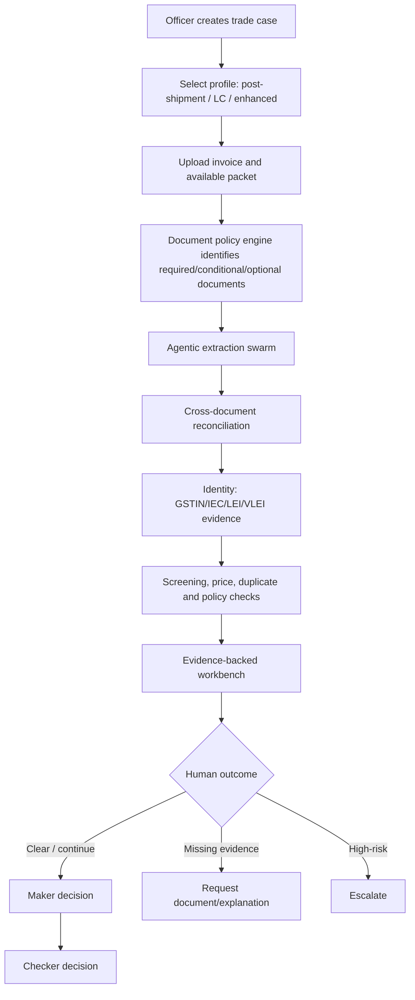
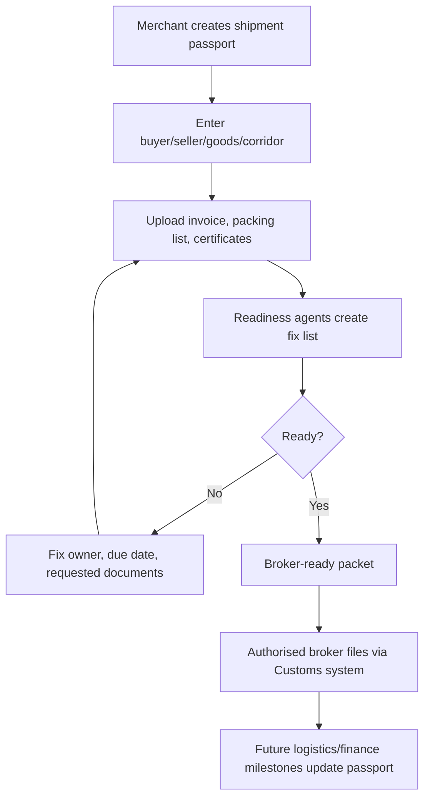
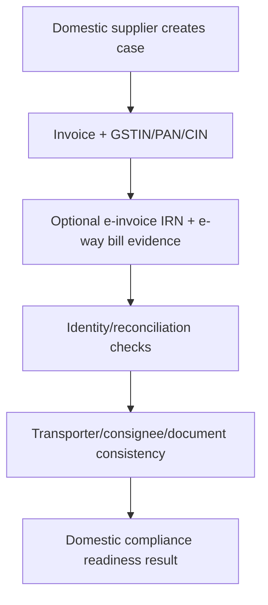

# TradePulse AI
## Product Requirements Document — Unified Trade Trust and Compliance Fabric

**Version:** 7.0 — Full-context restoration and identity expansion  
**Supersedes:** `tradepulse-prd-v5-bank-tradehouse.md`, `tradepulse-prd-v6-lei-vlei.md`, mentor `PRD.md`  
**Primary users:** Bank compliance officers; GIFT IFSC trade-house compliance/operations analysts  
**Secondary users / future modules:** Exporters, freight forwarders, customs brokers, logistics partners  
**Engineering team:** Abhishek, Ansh, Atharva — Main Engineers  
**Prototype target:** 22-hour GIFT IFIH hackathon build  

> **Product boundary:** TradePulse creates a trusted, evidence-backed digital trade case. It does not inspect containers, issue Customs clearance, submit ICEGATE filings, access ULIP/ICEGATE without authorization, release funds, or make final legal, sanctions, or credit decisions.

---

# 1. Why This Version Exists

The mentor MVP correctly narrows the first live demo to invoice plus Bill of Lading, GLEIF-backed entity lookup, price anomaly, and duplicate-submission signal. That focus is essential for execution.

The earlier architecture correctly identified a much larger enduring product: a trade-trust fabric that connects documents, entity identity, regulation changes, logistics evidence, finance readiness and exception workflow.

**This PRD does not discard either.** It separates them into:

1. **Hackathon kernel:** the smallest complete proof of value that runs live.
2. **Product platform:** the extensible architecture and roadmap that makes TradePulse a company rather than a single OCR feature.
3. **Integration strategy:** government/logistics interoperability only through approved partnerships and APIs, never by claiming sovereign authority.

---

# 2. Product Definition

TradePulse AI is an agentic, evidence-first trade-trust and compliance platform for cross-border and domestic trade workflows.

For a bank or GIFT IFSC trade-house officer, it turns a packet of trade documents into a structured case: it extracts facts, challenges ambiguities, reconciles documents, anchors counterparties to the strongest available identity evidence, screens configured risk sources, checks regulatory/document requirements, detects duplicate-submission signals, and routes a human reviewer to the exact action required.

For the broader trade ecosystem, TradePulse evolves into a **Shipment & Finance Passport**: a versioned digital case file that can follow a transaction through merchant preparation, broker/customs readiness, logistics milestones, trade-finance review, payment readiness and post-shipment evidence.

## 2.1 One-line pitch

> TradePulse AI is an agentic trade-trust workbench that converts scattered trade documents and identity evidence into one reconciled, compliance-ready case file—helping bank and GIFT IFSC trade-house officers review faster while preparing the foundation for seamless merchant-to-finance trade flows.

## 2.2 Core promise

> We do not claim to know what is physically inside a container. We make the digital evidence around a shipment complete, consistent, current and actionable—so the right human can make a faster, defensible decision.

---

# 3. Product Strategy: Kernel, Platform, Ecosystem

## 3.1 Hackathon kernel — build and demo now

- Commercial Invoice required.
- Bill of Lading/AWB conditionally required for post-shipment reconciliation.
- Agentic document intelligence swarm.
- LEI/GLEIF candidate resolution.
- VLEI-ready evidence model/fixture state.
- Counterparty/watchlist screening with clearly labelled demo or configured source.
- Price anomaly indicator.
- Duplicate invoice/BoL submission signal.
- Required/conditional/optional document checklist.
- Bank/trade-house maker-checker review surface.
- Audit trail.
- One regulation-change event and selective replay if time permits.

## 3.2 Platform modules — preserve in design, deliver iteratively

- Packing-list/package/weight plausibility.
- Certificate-of-origin and origin-country controls.
- LC terms-lite, insurance and draft checks.
- Merchant shipment-readiness console.
- Broker/forwarder exception workspace.
- Logistics milestones, container/seal/weight and carrier evidence adapters.
- RegWatch across corridor/regulator/rule sources.
- Institution-specific rule packs.
- Permissioned duplicate-finance registry.
- LEI/VLEI identity network and authorised-role evidence.
- GST/GSTIN and e-invoice/e-way-bill evidence for domestic Indian trade.
- ULIP/ICEGATE or government-system integration only when authorised.

## 3.3 Ecosystem ambition — not a false claim

TradePulse does not replace ICEGATE, Customs RMS, GSTN, ULIP, IFSCA, banking core systems or physical inspection. It becomes an interoperability and readiness layer around them.

---

# 4. Users and Commercial Wedge

## Primary user 1 — Bank/IBU compliance officer

Reviews documentary trade presentations before trade credit, LC handling, factoring, guarantees, financing, payment review or escalation.

**Pain:** Manual document reading, inconsistent decisions, fragmented entity evidence, missed discrepancies, audit burden and delayed turnaround.

## Primary user 2 — GIFT IFSC trade-house compliance/operations analyst

Reviews documents, counterparties, policies and finance readiness for cross-border trade transactions.

**Pain:** Regulations are scattered; documents arrive incomplete; exceptions are managed by email/spreadsheets; financing waits for clarity.

## Secondary future user — Merchant/exporter/importer

Uses a merchant-facing readiness console to prevent avoidable document/regulatory/finance issues before broker filing or bank presentation.

## Economic buyer

- Head of Trade Finance Operations.
- Head of Transaction Banking.
- Compliance leader.
- Trade-house operations head.
- Factor/receivables-finance provider.

---

# 5. Identity Strategy: LEI, VLEI, GSTIN and Domestic Trade

## 5.1 Correct principle

LEI and VLEI are **not only for cross-border trade**. They are globally usable organisational-identity standards; an LEI is a unique 20-character identifier for a legal entity, and a vLEI enables computational verification of identity, authority and role of people acting for a legal entity. [web:317][web:318]

However, LEI/VLEI adoption is particularly valuable in cross-border finance because entities, banks, jurisdictions and counterparties need a common global identity language.

For domestic Indian trade, **GSTIN**, PAN, company/LLP registration details, e-invoice IRN where applicable, and e-way-bill evidence are generally more operationally relevant identity/compliance inputs. The e-way bill system uses GSTIN-based participation and supports documented movement of goods; GST Council material describes e-way bills as electronic documents evidencing movement of goods and requiring consignment/party/transporter information. [web:311][web:316]

## 5.2 Identity evidence ladder

TradePulse must use the strongest available identity evidence for the corridor and transaction profile:

| Context | Primary evidence | Supporting evidence | TradePulse outcome |
|---|---|---|---|
| Cross-border bank/trade-house case | LEI; VLEI if available | GLEIF record, registry ID, BIC, address, incorporation data | Global entity resolution and authority evidence |
| India domestic B2B trade | GSTIN, PAN, CIN/LLPIN | GST registration data, e-invoice IRN, e-way bill, address | Domestic business identity and movement evidence |
| India exporter/importer | IEC plus GSTIN/PAN; LEI if entity has one | AD code, CIN/LLPIN, certificate/registry data | Export/import operational identity plus finance identity |
| Person acting for company | VLEI role credential if available | Board mandate, power of attorney, KYC documentation | Authority evidence, never sole legal conclusion |
| Entity lacks stable identifier | Name/address/country candidate retrieval | Broker/bank KYC documents | `REVIEW_REQUIRED`, not verified |

## 5.3 LEI requirements

- Treat LEI as a first-class identifier in every case, not exclusively cross-border.
- Use GLEIF as a global entity-reference source where accessible.
- Document-provided LEI plus compatible GLEIF record is strong identity evidence.
- LEI found by name search is a candidate, not automatic verification.
- LEI status must be visible: issued, lapsed, retired, unknown/not found.
- Parent/child relationship data is roadmap evidence for group-risk review.

## 5.4 VLEI requirements

- VLEI is a verifiable credential layer associated with legal-entity identity and authorized roles.
- Treat it as stronger cryptographic identity/authority evidence when verified through trusted infrastructure.
- Do not build cryptographic credential verification from scratch in 22 hours.
- Prototype supports `VERIFIED_FIXTURE`, `NOT_CONFIGURED`, `EXPIRED`, `REVOKED`, `INVALID`, and `VERIFIED_LIVE` states.
- A plain LEI string or arbitrary JSON must never be labelled a verified VLEI credential.

## 5.5 GSTIN/domestic requirements

- Add `GSTIN`, `PAN`, `CIN/LLPIN`, `IEC`, `e_invoice_irn`, and `e_way_bill_number` fields to identity/document schemas.
- Validate format/checksum only if authoritative validation source is not configured; do not claim live GST portal verification without authorization.
- For domestic profile, GSTIN/PAN/CIN are the default identity evidence; LEI/VLEI enrich but do not replace them.
- For cross-border profile, IEC/GSTIN/PAN identify the Indian party operationally, while LEI/VLEI improve global counterparty and finance identity.

---

# 6. Core Features

## 6.1 Trade Case / Shipment & Finance Passport

Every case is a versioned digital passport containing:

```text
Commercial layer
- buyer, seller, goods, quantity, price, currency, Incoterm, corridor

Identity layer
- GSTIN/PAN/CIN/IEC where relevant
- LEI/GLEIF candidate evidence
- VLEI authority evidence where available

Document layer
- invoice, BoL/AWB, packing list, origin, LC, insurance, draft, KYC

Compliance layer
- sanctions/restricted-party checks
- document consistency
- price indicator
- policy/rule findings
- duplicate-submission signals

Logistics evidence layer
- container, seal, weight, booking, gate-in, departure, carrier document
- future authorised carrier/ULIP/port feeds

Finance layer
- LC/collection/factoring/trade-credit checklist
- document presentation readiness

Governance layer
- source snapshots, rule versions, model/prompt versions, agent trace, human actions
```

## 6.2 Agentic document intelligence swarm

- Extractor: typed fields from each document.
- Validator: independent check of critical fields.
- Challenger: detects ambiguity, missing evidence and conflicts.
- Arbiter: accepts only evidence-supported values or routes to review.
- Cross-document reconciler: compares facts across packet.
- Regulation navigator: determines relevant document/policy checklist from profile/corridor/HS code.
- Readiness agent: turns deterministic results into a prioritized fix list.

All agents are bounded; no free-form autonomous tool access, no legal conclusion, no unlimited debate.

## 6.3 Document completeness and profile engine

Profiles:

```text
INVOICE_ONLY_PRE_REVIEW
POST_SHIPMENT_DOCUMENT_REVIEW
LC_DOCUMENT_REVIEW
DOCUMENTARY_COLLECTION_REVIEW
TRADE_HOUSE_ENHANCED_REVIEW
DOMESTIC_INDIA_GOODS_MOVEMENT
```

The engine labels each requirement:

```text
REQUIRED FOR THIS CASE
CONDITIONALLY REQUIRED
OPTIONAL / SUPPORTING
NOT APPLICABLE
NOT PROVIDED
NOT AVAILABLE
POLICY CONFIGURATION REQUIRED
```

## 6.4 Cross-document reconciliation

Compare:

- Seller/shipper and buyer/consignee/notify party.
- GSTIN/IEC/LEI where present.
- Goods/HS description.
- Quantity/unit/package count.
- Gross/net weight when packing list exists.
- Invoice number, BoL/AWB reference, container/seal where present.
- Dates, ports and origin.
- Currency, unit price, totals and arithmetic.
- LC-required document list where LC profile is selected.

## 6.5 Entity and authority evidence

- GLEIF/LEI candidate lookup.
- Domestic GSTIN/PAN/CIN evidence storage.
- VLEI-ready credential state.
- Name/address/country fuzzy matching only for candidate retrieval.
- Clear separation of identity resolution and sanctions screening.

## 6.6 Sanctions, restricted parties and goods

- Configured snapshots/watchlists.
- Counterparty, vessel and goods keyword/HS checks where data exists.
- Potential match/review language.
- Source freshness and coverage visible.
- Never treat fuzzy match as confirmed sanction.

## 6.7 Price plausibility / TBML indicator

- Benchmark mapping.
- Unit/currency normalization.
- Variance calculation.
- Contract/grade/freight/insurance limitation warning.
- Risk indicator, not fraud conclusion.

## 6.8 Duplicate-financing signal and future registry

- Local duplicate hash in prototype: invoice number + BoL/AWB reference + seller/currency/amount where available.
- Signal repeat submission.
- Future: permissioned, privacy-preserving multi-lender registry; no claim of cross-bank detection in prototype.

## 6.9 RegWatch

- Official source registry: IFSCA, DGFT, RBI/FEMA, CBIC/Customs context, sanctions publishers, ICC references, selected destination-corridor sources.
- Detect/capture update.
- Summarise/propose only.
- Human approves rule/data change.
- Versioned deployment.
- Selective replay of affected active cases.

## 6.10 Merchant/Logistics Readiness — future but designed now

- Merchant pre-filing document checklist.
- Broker-ready packet.
- Logistics milestone timeline.
- Container/seal/weight evidence.
- Exception owner/deadline.
- Future authorised ULIP/ICEGATE/carrier integrations.

ULIP is relevant as a future interoperability context: it was launched under India’s National Logistics Policy to create a more integrated, data-driven logistics ecosystem. TradePulse must not claim ULIP access without approval. [web:313][web:315]

---

# 7. Official Documents and Conditional Policy

| Document | Core purpose | Bank/trade-house policy | Merchant/logistics future use |
|---|---|---|---|
| Commercial Invoice | Commercial facts/value/parties/goods | Required always | Required always |
| BoL/AWB | Transport receipt and shipment reference | Required for post-shipment reconciliation | Required after carrier issuance |
| Packing List | Package/weight/contents detail | Conditional | Stronger physical-plausibility evidence |
| Certificate of Origin | Origin evidence | Conditional by policy/corridor/LC | Conditional by trade preference/corridor |
| LC | Bank undertaking/terms | Required only in LC profile | Finance readiness |
| Draft/Bill of Exchange | Payment demand | Conditional | Collection/LC workflow |
| Insurance certificate | Coverage | Conditional | Incoterm/contract dependent |
| Shipping Bill/BoE | Customs declaration evidence | Optional/future evidence | Customs milestone evidence |
| KYC/KYB | Counterparty identity | Conditional/enhanced review | Onboarding evidence |
| GST e-invoice/IRN | Domestic tax invoice evidence | Domestic profile | Domestic B2B readiness |
| E-way bill | Domestic goods-movement evidence | Domestic profile | Goods movement timeline |
| Inspection certificate | Defined inspection evidence | Conditional | Conditional |

---

# 8. User Flows

## 8.1 Bank / trade-house post-shipment review



## 8.2 Merchant pre-readiness future flow



## 8.3 Domestic India goods-movement profile



---

# 9. Non-Functional Requirements

| Requirement | Target |
|---|---|
| Prepared demo packet latency | Under 30 seconds live; under 5 seconds cached |
| Auditability | Every material finding has source/evidence/version metadata |
| Agent safety | Max 3 rounds; unresolved → review |
| Identity safety | LEI candidate ≠ verified identity; VLEI fixture ≠ live verification |
| Data honesty | Live/cached/mock/synthetic/planned/unavailable labels |
| Reliability | Offline cached hero cases work |
| Modularity | New document types/profiles/rules/adapters can be added without rewriting core |
| Security prototype | No real customer data; no secrets in source/logs |

---

# 10. Team and Sprints

## Abhishek — Main Engineer, Platform/Intelligence

- Backend, schemas, storage, API.
- Agent swarm and document extraction.
- Profile/policy engine.
- LEI/GLEIF adapter, VLEI adapter boundary/fixture.
- GSTIN/IEC/PAN fields and validation format layer.
- Screening, price, duplicate, RegWatch, audit and deployment.

## Ansh — Main Engineer, Product/Workbench

- Frontend, case queue, document checklist, document review, agent evidence UX.
- Identity drawer for GSTIN/IEC/LEI/VLEI.
- Findings, maker/checker, audit and RegWatch UI.
- Merchant/readiness roadmap views only if core is stable.

## Atharva — Main Engineer, Integration/UIUX/Quality

- UI design system, responsive/accessibility.
- Evidence visualization, document comparison components.
- Frontend/backend integration support.
- Component/visual testing and demo polish.
- Future domestic/merchant profile UI prototypes after core build.

## Sprint sequence

### Sprint 1: Foundation

- Case model includes `transaction_profile` and universal identity fields.
- Tag `v0.1-skeleton`.

### Sprint 2: Invoice intelligence

- Invoice extraction, swarm trace, invoice-only profile.
- Tag `v0.2-invoice-intelligence`.

### Sprint 3: Packet reconciliation

- BoL/AWB plus packing-list-capable schema, profile policy engine, mismatch UI.
- Tag `v0.3-document-reconciliation`.

### Sprint 4: Trade trust

- GLEIF/LEI, VLEI fixture boundary, GSTIN/IEC/PAN fields, screening, price and duplicate checks.
- Tag `v0.4-trade-trust-workbench`.

### Sprint 5: Regulations and lifecycle

- Rule packs, RegWatch, audit, replay, source freshness.
- Tag `v0.5-regwatch`.

### Sprint 6: Future-ready surface and hardening

- Merchant readiness roadmap screen, logistics-evidence schema, offline fallback, QA and demo.
- Tag `v0.6-integration`, then `demo-safe`.

---

# 11. Unique Pain Point and Differentiation

The unique pain point is not merely “OCR is slow.” It is **identity and evidence fragmentation across documentary trade**:

- A bank sees a name on an invoice.
- A trade house sees a slightly different name on a BoL.
- A domestic party is known by GSTIN/PAN/CIN.
- A global counterparty may have an LEI.
- An authorised signatory may later prove authority through VLEI.
- Documents are checked separately, rules change separately, and duplicate documents can be reused.

TradePulse creates one evidence graph that answers:

```text
Which entity is this?
What identity evidence supports that answer?
Which documents support the transaction facts?
Which facts conflict?
Which rule/source version produced the finding?
What must the human do next?
```

This becomes a long-term trade-trust layer—not a generic parser.

---

# 12. Definition of Done

- [ ] Invoice-only case works.
- [ ] Invoice+BoL packet reconciliation works.
- [ ] Packing-list/LC/origin documents are supported by policy schema even if not all demoed.
- [ ] Agent swarm is bounded and traceable.
- [ ] LEI/GLEIF is first-class identity evidence.
- [ ] VLEI is first-class but honestly labelled fixture/live/not configured.
- [ ] GSTIN/PAN/CIN/IEC fields support Indian domestic/cross-border contexts.
- [ ] Domestic profile distinguishes e-invoice/e-way-bill evidence from cross-border LEI/VLEI use.
- [ ] Fuzzy names never equal verified identity.
- [ ] Price indicator never equals fraud conclusion.
- [ ] Duplicate signal never equals proven duplicate financing.
- [ ] RegWatch/rule versioning remains human approved.
- [ ] Merchant/logistics/ULIP/ICEGATE items are preserved as authorised future integration paths, not false live claims.
- [ ] Three golden cases, offline fallback and `demo-safe` tag pass QA.
