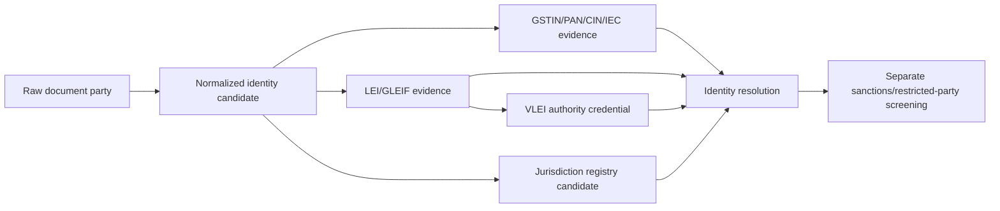
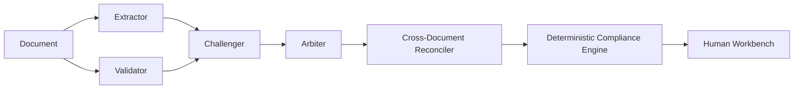
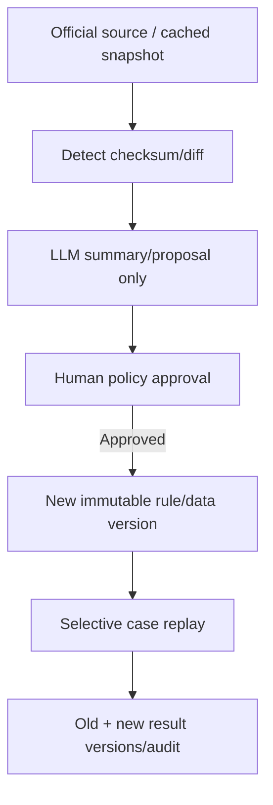

# TradePulse AI
## System Design — Unified Trade Trust Fabric

**Version:** 4.0 — Full-context, LEI/VLEI/GSTIN, platform-ready system design  
**Supersedes (historical):** prior bank/tradehouse and LEI/VLEI system-design drafts; mentor `SYSTEM_DESIGN.md`  
**Product authority:** `tradepulse-prd-v7-unified-trade-trust.md`  
**Contracts:** `docs/adr/001-canonical-contracts-addendum.md` and `packages/contracts/` are binding for shared enums.  
**Team:** Abhishek, Ansh, Atharva  
**Prototype:** 22-hour modular monolith, architected for iterative platform expansion

> **Invariant:** No claim without evidence; no stable identity from fuzzy name alone; no silent pass when data is unavailable; no automatic credit/compliance decision; no unapproved rule deployment; no historical-result overwrite after replay.

---

# 1. Architectural Intent

TradePulse has two simultaneous requirements:

1. It must demonstrate a small, reliable invoice-plus-BoL compliance workflow in a hackathon.
2. It must retain a credible architecture for a broader trade-trust platform spanning identity, documents, regulation, trade finance, domestic GST evidence, logistics milestones and authorised government interoperability.

The answer is not to remove capabilities. It is to use a **stable canonical TradeCase model** with profile-driven modules. The hackathon activates only a small set of modules; future profiles turn on additional documents, identities, rules and integrations without rewriting the core.

---

# 2. Canonical TradeCase Architecture

```mermaid
flowchart TB
    UI[Bank / Trade-House Workbench] --> API[FastAPI API]
    FUTURE_UI[Future Merchant Readiness Console] --> API

    API --> CASE[TradeCase Service]
    API --> INTAKE[Document Intake]
    API --> ORCH[Bounded Agentic Orchestrator]
    API --> POLICY[Profile / Document / Rule Policy Engine]
    API --> REGWATCH[RegWatch]
    API --> AUDIT[Audit Service]

    INTAKE --> DOCSTORE[File Store]
    CASE --> DB[(SQLite now / PostgreSQL later)]
    AUDIT --> DB

    ORCH --> PARSER[PDF/Image Layout Parser]
    ORCH --> EXT[Extractor]
    ORCH --> VAL[Validator]
    ORCH --> CHAL[Challenger]
    ORCH --> ARB[Arbiter]
    ORCH --> CROSS_DOCUMENT_RECONCILER[Cross-Document Reconciler]
    ORCH --> LLM[Model Adapter]

    POLICY --> DOCREQ[Document Requirement Engine]
    POLICY --> IDENTITY[Identity Evidence Engine]
    POLICY --> SCREEN[Screening Engine]
    POLICY --> PRICE[Price Plausibility]
    POLICY --> DUP[Duplicate Signal]
    POLICY --> READINESS[Readiness / Risk Router]

    IDENTITY --> GLEIF[GLEIF / LEI Adapter]
    IDENTITY --> VLEI[VLEI Verifier Adapter]
    IDENTITY --> INDIA[GSTIN/PAN/CIN/IEC Adapter Boundary]
    SCREEN --> SNAP[Versioned Risk Snapshots]
    PRICE --> REF[Price References]
    POLICY --> PACKS[Versioned Rule Packs]

    REGWATCH --> SOURCES[Source Registry]
    REGWATCH --> DIFF[Change Diff / Proposal]
    REGWATCH --> REPLAY[Selective Replay]

    FUTURE_LOG[Future Authorised Logistics Sources] -.-> LOGEVID[Logistics Evidence Adapter]
    FUTURE_GOV[Future Authorised ICEGATE/ULIP/GST Interfaces] -.-> GOVADAPT[Government Integration Adapter]
    LOGEVID -.-> CASE
    GOVADAPT -.-> CASE
```



---

# 3. Trade Profiles

The same canonical model supports profile-specific evidence and rules.

| Profile | Primary use | Identity priority | Required documents |
|---|---|---|---|
| `INVOICE_ONLY_PRE_REVIEW` | Early bank/trade-house triage | GSTIN/IEC/LEI as available | Invoice |
| `POST_SHIPMENT_DOCUMENT_REVIEW` | Bank/trade-house post-shipment review | LEI/GSTIN/IEC | Invoice + BoL/AWB |
| `LC_DOCUMENT_REVIEW` | Documentary-credit readiness | LEI/VLEI + LC parties | Invoice + LC + configured required documents |
| `DOCUMENTARY_COLLECTION_REVIEW` | Collection/draft workflow | LEI/GSTIN/IEC | Invoice + configured transport/payment docs |
| `ENHANCED_TRADE_HOUSE_REVIEW` | Expanded compliance packet | LEI/VLEI/GSTIN/IEC | Invoice + BoL/AWB; conditional supporting docs |

> Non-normative illustration. Hackathon `TradeProfile` source of truth is `packages/contracts/enums.py`. Merchant readiness is deferred roadmap scope (not a kernel `TradeProfile` value).


Document policy is data, not hardcoded if/else logic.

---

# 4. Canonical Data Model

## 4.1 TradeCase

```python
class TradeCase(BaseModel):
    id: UUID
    profile: TradeProfile
    corridor: str | None  # IN-AE, IN-GB, IN-DOMESTIC, etc.
    status: CaseStatus
    readiness_route: ReadinessRoute
    identities: list[IdentityEvidence]
    documents: list[Document]
    document_requirements: list[DocumentRequirement]
    findings: list[RuleResult]
    result_versions: list[CaseResultVersion]
    logistics_evidence: list[LogisticsEvidence]
    created_at: datetime
    updated_at: datetime
```

## 4.2 Identity Evidence Graph



```python
class IdentityEvidence(BaseModel):
    role: Literal["SELLER", "BUYER", "SHIPPER", "CONSIGNEE", "NOTIFY_PARTY", "VESSEL", "SIGNATORY"]
    raw_name: str | None
    normalized_name: str | None
    country: str | None
    address: str | None

    gstin: str | None
    pan: str | None
    cin_llpin: str | None
    iec: str | None
    e_invoice_irn: str | None
    e_way_bill_number: str | None

    lei: LEIEvidence | None
    vlei: VLEIEvidence | None
    registry_candidates: list[RegistryCandidate]
    resolution_status: IdentityResolutionStatus
```

## 4.3 LEI/VLEI models

```python
class LEIEvidence(BaseModel):
    lei: str | None
    legal_name: str | None
    legal_address: str | None
    jurisdiction: str | None
    entity_status: str | None
    registration_status: str | None
    parent_lei: str | None
    source: Literal["GLEIF", "DOCUMENT", "FIXTURE"]
    source_url: str | None
    retrieved_at: datetime | None
    snapshot_id: str | None
    is_exact_document_match: bool

class VLEIEvidence(BaseModel):
    credential_id: str | None
    subject_lei: str | None
    issuer: str | None
    signer_role: str | None
    status: Literal[
        "VERIFIED_LIVE", "VERIFIED_FIXTURE", "NOT_CONFIGURED",
        "INVALID", "EXPIRED", "REVOKED", "DATA_UNAVAILABLE"
    ]
    issued_at: datetime | None
    expires_at: datetime | None
    evidence_hash: str | None
    source: str
```

Rules:

- LEI can be used in domestic or cross-border cases, but is especially useful for global entity interoperability.
- VLEI can be used in domestic or cross-border cases; it is an authority/role credential, not inherently a border-only technology.
- GSTIN/PAN/CIN/IEC are priority domestic/Indian operational identifiers.
- A name similarity is never identity verification.
- LEI/VLEI identity result and sanctions result are separate domains.

---

# 5. Document Policy Model

```python
class DocumentRequirement(BaseModel):
    document_type: DocumentType
    state: Literal[
        "REQUIRED", "CONDITIONALLY_REQUIRED", "OPTIONAL",
        "NOT_APPLICABLE", "NOT_PROVIDED", "NOT_AVAILABLE"
    ]
    blocker: bool
    rule_id: str
    reason: str
```

Examples:

```yaml
profile: POST_SHIPMENT_DOCUMENT_REVIEW
requirements:
  - document: COMMERCIAL_INVOICE
    state: REQUIRED
    blocker: true
  - document: BILL_OF_LADING_OR_AWB
    state: REQUIRED
    blocker: true
  - document: PACKING_LIST
    state: CONDITIONALLY_REQUIRED
    blocker: false
  - document: CERTIFICATE_OF_ORIGIN
    state: CONDITIONALLY_REQUIRED
    blocker: false
```

```yaml
profile: DOMESTIC_INDIA_GOODS_MOVEMENT
requirements:
  - document: COMMERCIAL_INVOICE
    state: REQUIRED
    blocker: true
  - document: E_INVOICE_IRN
    state: CONDITIONALLY_REQUIRED
    blocker: false
  - document: E_WAY_BILL
    state: CONDITIONALLY_REQUIRED
    blocker: false
```

---

# 6. Bounded Agentic Orchestration

## 6.1 Agent topology



## 6.2 Agent contracts

```python
class Evidence(BaseModel):
    page: int | None
    bbox: list[float] | None
    source_text: str | None
    document_id: UUID

class FieldClaim(BaseModel):
    field_path: str
    proposed_value: Any | None
    confidence: float
    evidence: Evidence | None
    reason: str

class Challenge(BaseModel):
    field_path: str
    category: Literal[
        "SOURCE_AMBIGUITY", "CROSS_DOCUMENT_CONFLICT",
        "ARITHMETIC_CONFLICT", "MISSING_EVIDENCE", "IDENTITY_CONFLICT"
    ]
    reason: str
    evidence: list[Evidence]

class AgentResult(BaseModel):
    agent: Literal["EXTRACTOR", "VALIDATOR", "CHALLENGER", "ARBITER", "CROSS_DOCUMENT_RECONCILER"]
    round: int
    status: Literal["COMPLETE", "REVIEW_REQUIRED", "FAILED"]
    claims: list[FieldClaim]
    challenges: list[Challenge]
```

## 6.3 Hard limits

```text
MAX_AGENT_ROUNDS = 3
MAX_AGENT_RETRIES = 1
AGENT_MUST_CITE_EVIDENCE = true
UNRESOLVED_OUTCOME = REVIEW_REQUIRED
```

No chain-of-thought is stored/displayed. Persist concise claims, evidence and reasons only.

---

# 7. Compliance Modules

## 7.1 Hackathon-active modules

| Module | Status |
|---|---|
| Invoice extraction | Active |
| BoL/AWB extraction | Active |
| Cross-document quantity/party/port checks | Active |
| GLEIF/LEI lookup/cache | Active |
| VLEI model/fixture boundary | Active if time permits |
| Demo/official snapshot screening | Active, labelled accurately |
| Price anomaly | Active |
| Duplicate signal | Active |
| Document completeness | Active |
| Audit/maker-checker | Active/lite |

## 7.2 Platform-preserved modules

| Module | Design status |
|---|---|
| Packing list/weight plausibility | Schema + rule interface preserved |
| Certificate of origin | Schema + document policy preserved |
| LC-lite | Profile + rule interface preserved |
| Insurance/draft | Policy interface preserved |
| GST/e-invoice/e-way bill | Domestic profile and evidence fields preserved |
| Merchant readiness | Case profile + API/UI roadmap preserved |
| Logistics evidence | Adapter/schema preserved |
| ULIP/ICEGATE | Authorised adapter boundary only |
| Shared duplicate registry | Interface/roadmap only |
| Full VLEI verification | Adapter interface only |

---

# 8. Identity, Screening and Trust Rules

## 8.1 Identity resolution order

```text
Exact verified stable ID (GSTIN/PAN/CIN/IEC/LEI as relevant)
  > VLEI-verified authority evidence when configured
  > registry-backed candidate with compatible address/country
  > name/address fuzzy candidate
  > unresolved
```

## 8.2 Distinct outputs

```text
Identity outcome: Which entity is this likely to be?
Screening outcome: Does this entity/candidate match a configured risk source?
Document outcome: Do facts reconcile?
Policy outcome: Is the packet complete under selected profile?
Price outcome: Is the declared price materially unusual versus reference?
```

Never collapse these into one unexplained “fraud score.”

## 8.3 Risk router

```text
Missing required document → DOCUMENT_PACK_INCOMPLETE
Unresolved agent/identity issue → REVIEW_REQUIRED
Potential sanctions/high severity policy → HIGH_RISK_ESCALATION
Price/mismatch/duplicate signal → MAKER_REVIEW_REQUIRED
All required checks complete → READY_FOR_HUMAN_REVIEW
Required source unavailable → DATA_REVIEW_REQUIRED
```

---

# 9. Regulation and Ecosystem Adapters

## 9.1 RegWatch



## 9.2 Future authorized integration interfaces

```python
class LogisticsEvidenceAdapter(Protocol):
    async def get_events(self, case: TradeCase) -> list[LogisticsEvidence]: ...

class GovernmentTradeAdapter(Protocol):
    async def get_status(self, reference: str) -> GovernmentStatusEvidence: ...
```

Adapters are not active until explicit access, consent, terms, security review and government/partner authorization exist.

---

# 10. Storage, API, Audit

## 10.1 Prototype storage

- SQLite: cases, documents, findings, identity evidence, audit, replay versions.
- Filesystem/S3-compatible storage: uploaded docs.
- Local JSON: static rule packs, fixtures, reference prices, snapshots.

## 10.2 API surface

```text
POST /api/v1/cases
GET  /api/v1/cases
GET  /api/v1/cases/{id}
POST /api/v1/cases/{id}/documents
POST /api/v1/cases/{id}/process
POST /api/v1/cases/{id}/actions
GET  /api/v1/cases/{id}/audit
GET  /api/v1/cases/{id}/versions
GET  /api/v1/document-policies
GET  /api/v1/identities/{id}
GET  /api/v1/sources
GET  /api/v1/regwatch/events
POST /api/v1/regwatch/events/{id}/approve
GET  /healthz
GET  /readyz
```

## 10.3 Audit chain

Each event includes actor, action, payload hash, previous hash, current hash, source/snapshot versions, model/prompt version and case-result version.

---

# 11. Failure Behavior

| Failure | Safe outcome |
|---|---|
| LLM invalid/timeout | Retry once, cache fallback or extraction review |
| Agent conflict after 3 rounds | Review required |
| GLEIF unavailable | Identity source unavailable; no verification |
| VLEI unavailable | Not configured/data unavailable; no VLEI claim |
| GST/Gov source unavailable | Store provided evidence only; no live-verification claim |
| Screening data unavailable | Data review required; no pass |
| Benchmark not mapped | Not applicable/data unavailable |
| BoL missing | Transport check unavailable or profile blocker |
| LC missing in LC profile | Document pack incomplete |
| RegWatch source failure | Keep active rule version, mark source degraded |
| DB failure | Readiness fail; no decisions persisted |

---

# 12. QA Matrix

## Identity

- Cross-border entity with exact LEI.
- LEI candidate by name only.
- Lapsed LEI.
- Domestic GSTIN/PAN/CIN fixture.
- IEC/GSTIN for Indian exporter fixture.
- VLEI verified fixture.
- VLEI not configured.
- VLEI expired/revoked/invalid fixture.
- Similar name with conflicting country/address.

## Documents

- Invoice only.
- Invoice + BoL match.
- Invoice + BoL mismatch.
- Packing-list weight/package mismatch.
- Certificate-of-origin missing when policy requires it.
- LC missing in LC profile.
- Domestic e-invoice/e-way-bill conditional state.

## Agentic flow

- Agreement.
- Evidence-backed correction.
- Unresolved ambiguity.
- Max-round termination.

## Compliance

- Price anomaly.
- No price mapping.
- Duplicate signal.
- Potential screening candidate.
- Data unavailable.
- RegWatch replay preserving old result.

---

# 13. Delivery Plan

## v0.1 Foundation

Canonical TradeCase, profile field, universal identity fields, API/frontend shell.

## v0.2 Invoice swarm

Invoice, agent trace, evidence workbench, invoice-only profile.

## v0.3 Packet reconciliation

BoL/AWB, packing-list-capable schema, policy engine and document comparison.

## v0.4 Trade Trust

LEI/GLEIF, VLEI fixture boundary, GSTIN/IEC/PAN fields, screening, price and duplicate modules.

## v0.5 Regulations

Source registry, rule packs, RegWatch, audit/replay.

## v0.6 Hardening

Offline demo, UX, tests, deployment and `demo-safe`.

## Post-hackathon iterations

1. Merchant readiness UI.
2. Domestic India GST/e-invoice/e-way-bill adapter.
3. Logistics evidence adapter.
4. Authorised ULIP/ICEGATE ecosystem integration.
5. Full VLEI verifier.
6. Permissioned duplicate-finance registry.
7. Bank core/trade platform integration.

---

# 14. Final System Principle

TradePulse is valuable because it joins facts that are currently fragmented: documents, legal identity, authority, domestic identifiers, global identifiers, policy versions, price indicators, logistics evidence and human decisions.

Its first demo is intentionally narrow. Its architecture is intentionally broad. The narrow demo proves the broad platform can be built safely, iteratively and credibly.
