# TradePulse AI — System Design & Multi-Agent Engineering Plan

**Document status:** Engineering baseline for the GIFT IFIH hackathon prototype and post-hackathon evolution  
**Owners:** Ansh (Platform & Intelligence), Abhishek (Product, Compliance & Frontend), QA Engineer (Independent verification)  
**Classification:** Sensitive compliance prototype — *not approved for production decisions, funds movement, sanctions blocking, or regulatory reporting*  
**Last reviewed:** 2026-08-21  

---

## 0. Executive Summary

TradePulse AI is an API-first **trade-compliance decisioning workbench** for documentary trade. It receives a trade presentation — commercial invoice, bill of lading, packing list and optionally letter-of-credit terms — extracts structured facts with document intelligence, resolves counterparties against authoritative registries, screens parties/vessels/goods against versioned sanctions and export-control data, runs deterministic documentary/TBML rules, and routes results through a maker-checker workflow with immutable evidence.

A companion service, **RegWatch**, detects authoritative regulatory/list updates, creates a human-approved rule-pack change, versions it, and replays affected checks against active cases.

The product does **not** replace bank judgement. It reduces manual reading and makes discrepancies, uncertainty, source provenance and rule versions visible. For the hackathon, document instances and banking workflow data are synthetic; public reference data is clearly sourced and timestamped. The hackathon brief explicitly requires a synthetic-data strategy and evaluates regulatory realism and honesty about mocked versus production-ready components.

### Core safety thesis

> **No claim without evidence. No adverse decision based solely on an LLM. No rule change goes live without human approval. No result exists without data and rule versions.**

---

## 1. Product Scope and Non-Goals

### 1.1 In scope

- Trade-case intake: invoice, BoL, packing list, optional LC terms.
- Document intelligence: classify, extract, validate and attach source provenance.
- Counterparty resolution: GLEIF-first candidate lookup plus deterministic multi-attribute scoring.
- Sanctions/export controls: local, versioned snapshots with source attribution.
- Deterministic checks: document consistency, price anomaly, entity uncertainty, sanctions candidates, duplicate presentation, LC-document presence.
- Explainable risk routing and maker-checker decisions.
- Hash-chained audit log and rule/data version capture.
- RegWatch source registry, event lifecycle, human approval and selective replay.
- Synthetic test corridor and test datasets.

### 1.2 Explicit hackathon non-goals

- Real-money clearing, payment instruction, fund release or automatic trade rejection.
- Claiming sanctions certainty from fuzzy matching alone.
- Live integration into core banking, SWIFT, customs, KYC vendors or customer systems.
- Authentication/SSO beyond a clearly-labelled role simulator.
- Full legal implementation of all UCP 600/ISBP requirements.
- Full beneficial ownership investigation.
- Live web scraping of sources that prohibit automated access or do not publish usable interfaces.

### 1.3 Production-readiness boundary

The prototype may demonstrate a workflow but must display:

> **Prototype environment — synthetic transaction data. Outputs are decision-support recommendations requiring authorised human review.**

Before production, the system requires information-security review, model-risk management, legal/compliance sign-off, licensed data agreements, penetration testing, disaster recovery validation, independent rule validation, and jurisdiction-specific regulatory approvals.

---

## 2. Personas and Decisions

| Persona | Decision | Need from TradePulse |
|---|---|---|
| Maker — trade compliance analyst | Is this presentation ready to recommend, or does it need investigation? | Evidence, discrepancies, documents, source links, clear next action |
| Checker — senior officer | Can this case be approved after independent review? | Maker decision, full audit trail, unresolved-risk visibility |
| Regulatory analyst | Should a proposed regulatory change alter production rules? | Official source, effective date, proposed rule diff, impact analysis |
| Operations manager | Is the team processing cases safely and efficiently? | Queue, SLA, STP candidate rate, review volumes, reasons |
| Platform administrator | What data/rules powered a decision? | Data snapshots, rule-pack versions, event history, system health |

### Human decision state machine

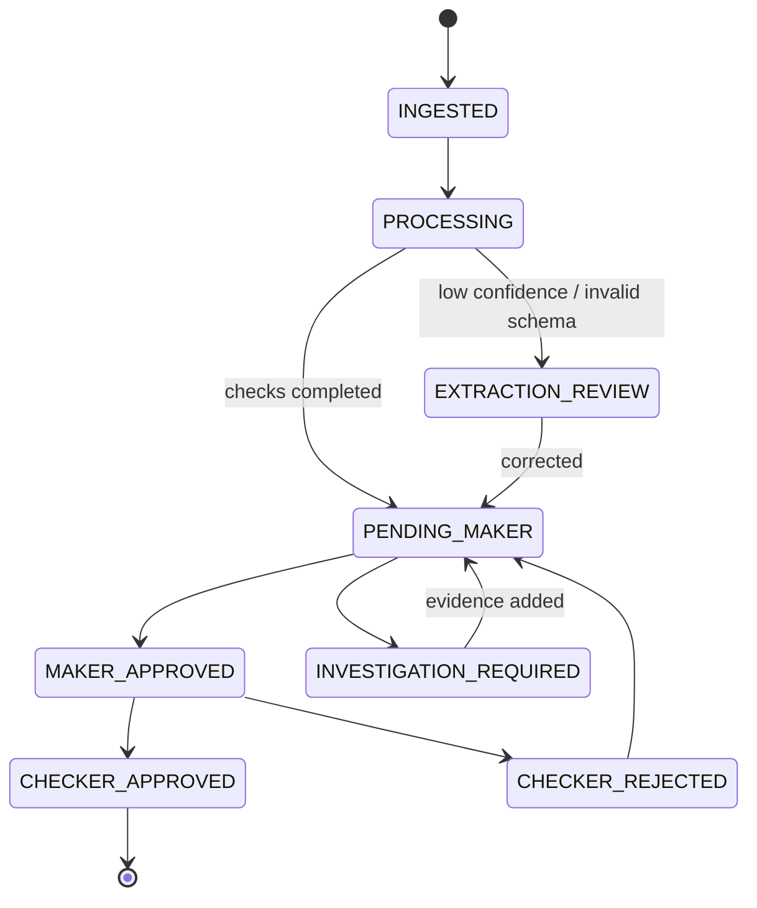

No automated check may transition a case to `CHECKER_APPROVED`. Automated checks may produce `STP_CANDIDATE`, but a configured institution policy would still control whether a human approval is required.

---

## 3. High-Level Architecture

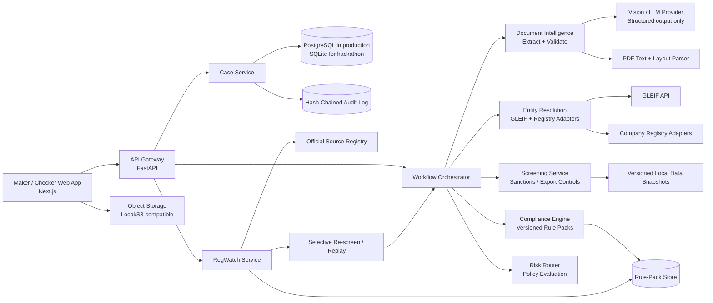

### Design principle: services are logical boundaries first

During the 22-hour hackathon, deploy a **modular monolith** — one FastAPI application with separated domain modules. Do not deploy microservices. The boundaries above exist in code and interfaces so they can become services after validation.

---

## 4. Trust Boundaries and Data Classification

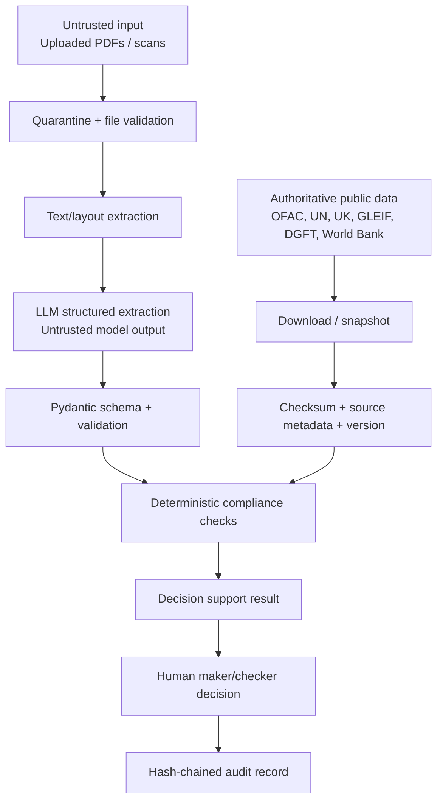

| Data class | Examples | Prototype control | Production control |
|---|---|---|---|
| Synthetic business data | Demo invoices, cases, users | Repo-local encrypted/ignored data folder | Tokenisation, encryption, retention policy |
| Public reference data | OFAC list, GLEIF result, World Bank prices | Source URL, downloaded-at time, checksum | Licensed/official ingest, signature/checksum verification, provenance |
| Sensitive customer data | Real trade documents, KYC details | Not permitted in prototype | Encryption, least privilege, DLP, data residency, DPIA |
| Derived compliance data | Scores, candidate matches, decisions | Audit log + demo labels | Tamper-evident store, retention/legal hold |
| Secrets | API keys, credentials | `.env`, gitignored | Secret manager, rotation, access policies |

---

## 5. Data Source Strategy

### 5.1 Authority hierarchy

1. **Authoritative publisher:** regulator, registry or intergovernmental body.
2. **Authoritative structured download/API:** use and snapshot locally.
3. **Credible aggregator:** use only with source attribution and marked coverage limits.
4. **Synthetic source:** only if no public/usable source exists; explicitly labelled.

### 5.2 Source matrix

| Domain | Preferred source | Ingestion strategy | Fallback | Hackathon choice |
|---|---|---|---|---|
| Global legal entities | GLEIF Global LEI Index API | Live candidate retrieval; cache response with time | OpenCorporates | Build live GLEIF adapter |
| India company existence | MCA master-data search / permitted public dataset | Manual/sample snapshot; do not bypass CAPTCHA | Synthetic registry fixture | Seed clearly-labelled CSV |
| UK company existence | Companies House API | API key, query/cache | OpenCorporates | Optional adapter |
| US sanctions | OFAC Sanctions List Service | Download official snapshot, hash/version/diff | OpenSanctions normalisation | Build local snapshot adapter |
| UN sanctions | UN Security Council Consolidated List | Download XML, normalise, hash/version | OpenSanctions | Build local snapshot adapter |
| UK sanctions | UK Sanctions List | Download official CSV/XML, version | OpenSanctions | Seed local snapshot |
| EU sanctions | EU consolidated financial sanctions list | Official snapshot/version | OpenSanctions | Seed local snapshot |
| US export controls | BIS Consolidated Screening List | Official source snapshot | OpenSanctions/CSL client | Seed rule/source card |
| Prices | World Bank Pink Sheet | Monthly Excel → curated price reference version | Synthetic only for uncovered goods | Use selected real commodity rows + synthetic mappings |
| India trade policy | DGFT notifications/public notices | Source registry + manual/cached event | Synthetic event only when needed | One real/cached DGFT event |
| Other regulatory rules | Official regulator publications | Source registry, human approved interpretation | Synthetic rule-pack fixture | Registry cards, no unsupported scraping |

### 5.3 Non-negotiable source metadata

Every imported record must retain:

```json
{
  "source_id": "OFAC_SDN",
  "publisher": "U.S. Department of the Treasury, OFAC",
  "source_url": "…",
  "retrieved_at": "2026-08-21T10:00:00Z",
  "effective_at": "2026-08-21T00:00:00Z",
  "checksum_sha256": "…",
  "parser_version": "sanctions-normalizer@1.0.0",
  "license_or_terms_note": "Official public list"
}
```

---

## 6. Core Domain Model

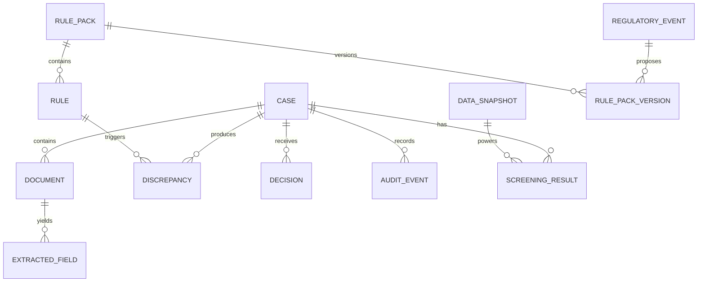

### 6.1 Minimal entities

- `Case`: ID, lifecycle state, risk route, assignee, SLA, timestamps.
- `Document`: type, object reference, SHA-256, parser/extraction state.
- `ExtractedField`: raw value, normalized value, confidence, page, bounding box, source text.
- `EntityResolution`: submitted entity, candidate LEIs/registries, attribute scores, policy outcome.
- `ScreeningResult`: source list/snapshot, match type, score, candidate, evidence.
- `RulePack`: jurisdiction, domain, semantic version, effective date, status.
- `Rule`: identifier, severity, logic descriptor, legal reference, test fixtures.
- `Discrepancy`: rule, status, evidence, remediation action, source provenance.
- `Decision`: actor role, action, comment, timestamp.
- `AuditEvent`: append-only event, prior hash, event hash.
- `RegulatoryEvent`: official source, lifecycle, summary, proposed diff, approval and replay impact.

### 6.2 Rule output contract

Every check — without exception — returns this contract:

```json
{
  "check_id": "TBML-PRICE-001",
  "rule_pack_version": "tbml-global@0.2.0",
  "status": "PASS | WARN | REVIEW_REQUIRED | FAIL | NOT_APPLICABLE | DATA_UNAVAILABLE",
  "severity": "INFO | LOW | MEDIUM | HIGH | CRITICAL",
  "score_contribution": 0,
  "reason": "Invoice price of USD 42/kg is 281.8% above benchmark USD 11/kg.",
  "rule_reference": "Internal TBML policy TP-TBML-001",
  "evidence": [{"field": "items[0].unit_price", "value": 42, "page": 1, "bbox": [0,0,0,0]}],
  "data_sources": [{"source_id": "WORLD_BANK_PINK_SHEET", "version": "2026-08"}],
  "recommended_action": "Confirm commodity grade and request supporting commercial rationale."
}
```

`DATA_UNAVAILABLE` is a valid safe result. It must never silently become `PASS`.

---

## 7. Phase 1 — Document Intelligence

### 7.1 Objective

Turn untrusted trade-document files into **validated, provenance-rich structured facts**. Extraction quality is measured and visible. LLM output is never treated as authoritative without validation.

### 7.2 Ingestion flow

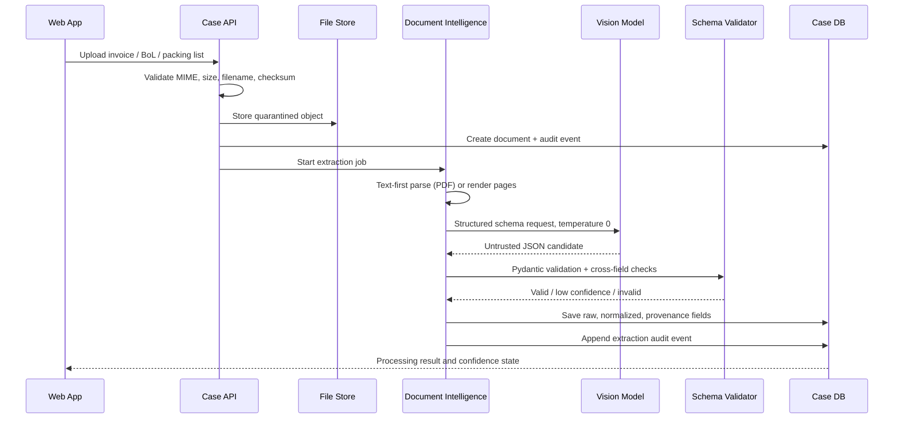

### 7.3 Extraction policy

- Prefer text/layout extraction from digital PDFs before vision inference.
- Use a fixed document-specific Pydantic schema.
- Require exact transcription, never inference for unknown values.
- Record `null` for absent fields; never invent data.
- Record field confidence, raw source text, page and coordinate where available.
- Validate totals, currencies, dates and quantity/unit price arithmetic deterministically.
- Route confidence below policy threshold (default 0.85) or invalid arithmetic to `EXTRACTION_REVIEW`.
- Cache only by SHA-256 document hash + schema/prompt/model version.

### 7.4 Extraction schemas

Required initial schemas:

- Commercial invoice: seller, buyer, invoice ID/date, currency, Incoterm, product items, quantity, unit, unit price, total, ports, HS code if present.
- Bill of lading: shipper, consignee, notify party, carrier, vessel, IMO if present, BoL ID, ports, goods description, container/quantity, issue date.
- Packing list: seller/buyer, package counts, net/gross weight, item-level quantities.
- LC terms-lite: LC number, applicant, beneficiary, required documents, expiry, Field 46A-style requirements.

### 7.5 Acceptance checkpoints

| Checkpoint | Pass condition | Owner |
|---|---|---|
| P1-C1 — Safe upload | Reject non-PDF, oversized and malformed uploads; compute SHA-256 | Ansh |
| P1-C2 — Schema contract | All 12 synthetic documents parse to validated Pydantic models or explicit review state | Ansh |
| P1-C3 — Provenance | Every displayed extracted field has source document/page; bounding box where supported | Abhishek |
| P1-C4 — Arithmetic validation | Deliberately altered totals/quantities are caught deterministically | QA |
| P1-C5 — Golden cache | Hero documents work with network disabled after cache warm-up | QA |

### 7.6 Failure mode rules

- Model timeout → retry once with idempotency key; then `PROCESSING_FAILED`, visible to user.
- JSON invalid → no partial approval; persist safely for diagnostics, route to review.
- Unknown document type → classify as `UNSUPPORTED`, no silent misclassification.
- Low extraction confidence → do not run high-confidence clearance path.

---

## 8. Phase 2 — Compliance Decision Engine

### 8.1 Objective

Evaluate deterministic, versioned policy rules against extracted facts and versioned reference data. Produce explainable outcomes, not autonomous financial decisions.

### 8.2 Compliance flow

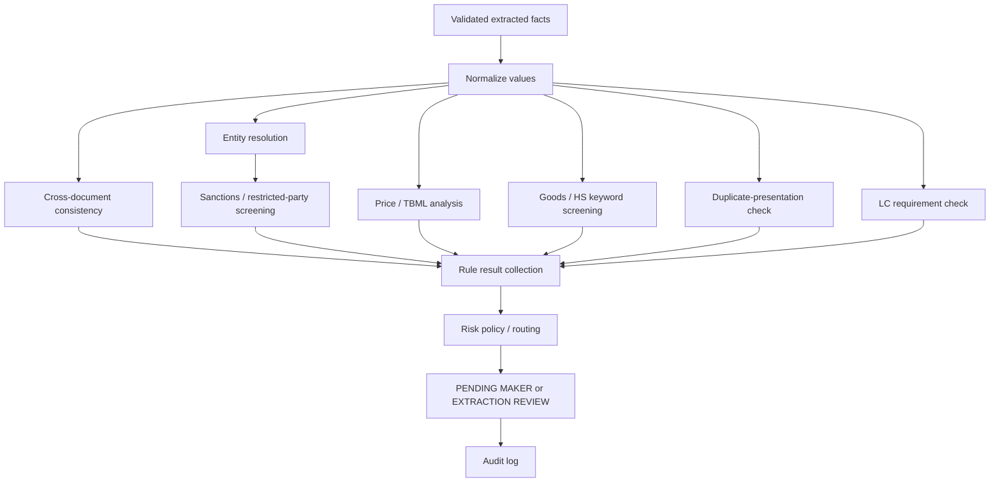

### 8.3 Entity resolution design

#### Principle

Fuzzy names retrieve candidates. Stable identifiers and corroborating attributes verify identity. A fuzzy score alone can never establish identity or a sanctions hit.

#### Pipeline

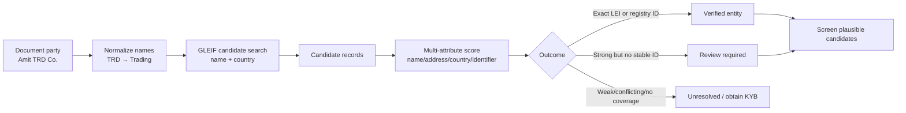

#### Conservative policy

- Exact LEI or verified authoritative company-registration ID + compatible attributes → `VERIFIED`.
- Name ≥92, country match, address ≥85, no identifier → `REVIEW_REQUIRED`.
- Name 75–92, missing attributes, conflict or close candidates → `REVIEW_REQUIRED`.
- No candidate / country conflict / score <75 → `UNRESOLVED`, not fraud.
- Sanctions matching is independent and runs across plausible candidates, aliases and vessel names.

#### Matching components

- Name: `rapidfuzz.token_set_ratio` after legal suffix removal and abbreviation normalization.
- Address: token similarity plus country/city/postal code exact sub-signals.
- Identifier: LEI/CIN/company number/BIC exact equality dominates score.
- Entity status: inactive/lapsed/unknown produces policy warning; it does not prove fraud.
- Candidate ambiguity: if top two candidates are close, force review.

### 8.4 Screening design

- Use **locally stored, versioned snapshots** for demo reliability and reproducibility.
- Initial normalised sources: OFAC SDN, UN consolidated, UK sanctions, optional EU/BIS.
- Keep names, aliases, entity types, countries, addresses, vessels/IMO fields and source IDs.
- For screening, record candidate list, algorithm version, thresholds and source snapshot ID.
- `possible match` is never called a confirmed sanction. Use `POTENTIAL_MATCH_REVIEW`.

### 8.5 TBML price anomaly design

1. Map item to commodity/benchmark category; show mapping confidence.
2. Convert invoice price to benchmark unit/currency using versioned FX source/snapshot.
3. Calculate deviation:

\[
\text{deviation} = \frac{|\text{invoice unit price} - \text{benchmark unit price}|}{\text{benchmark unit price}}
\]

4. Flag only according to explicit policy (e.g., warn >30%, high review >100%).
5. Show limitations: grade, contract terms, shipping, insurance, brand and timing affect price; this is a **risk indicator**, not proof of mis-invoicing.

### 8.6 Risk routing policy

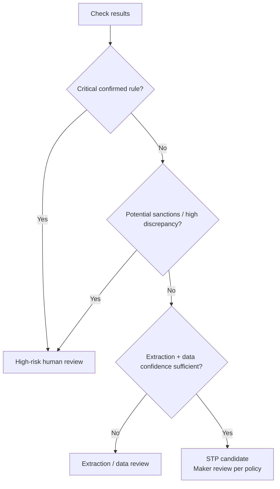

The UI must show a **reason breakdown**, not just a traffic light.

### 8.7 Acceptance checkpoints

| Checkpoint | Pass condition | Owner |
|---|---|---|
| P2-C1 — Rule pack loader | Rule packs validate against JSON schema and reject unknown versions | Ansh |
| P2-C2 — Entity ambiguity | `Amit TRD Co.` produces review, not automatic verification, without LEI/CIN | Ansh + QA |
| P2-C3 — Sanctions provenance | Every potential match exposes source list, snapshot time, score, aliases and candidate evidence | Ansh |
| P2-C4 — Cross-document checks | Quantity/port/party mismatch test fixture raises specific discrepancy + document pages | Abhishek + QA |
| P2-C5 — Price explainability | Over-invoice fixture produces benchmark, unit normalization, calculation and limitation notice | Abhishek |
| P2-C6 — No unsafe fallback | Missing source data returns `DATA_UNAVAILABLE`, never `PASS` | QA |
| P2-C7 — Maker-checker gate | Cannot checker-approve without maker approval; all transitions audited | Abhishek + QA |

---

## 9. Phase 3 — RegWatch Change Engine

### 9.1 Objective

Maintain a source-of-truth registry for regulatory data sources, detect updates, propose versioned rule/data changes, require human approval, then selectively replay affected checks.

### 9.2 Regulatory lifecycle

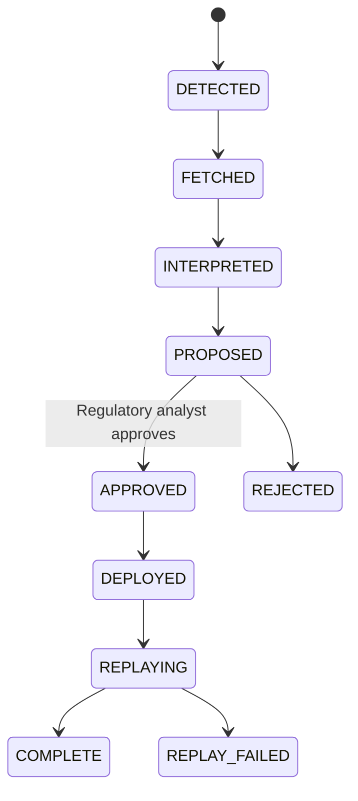

### 9.3 RegWatch flow

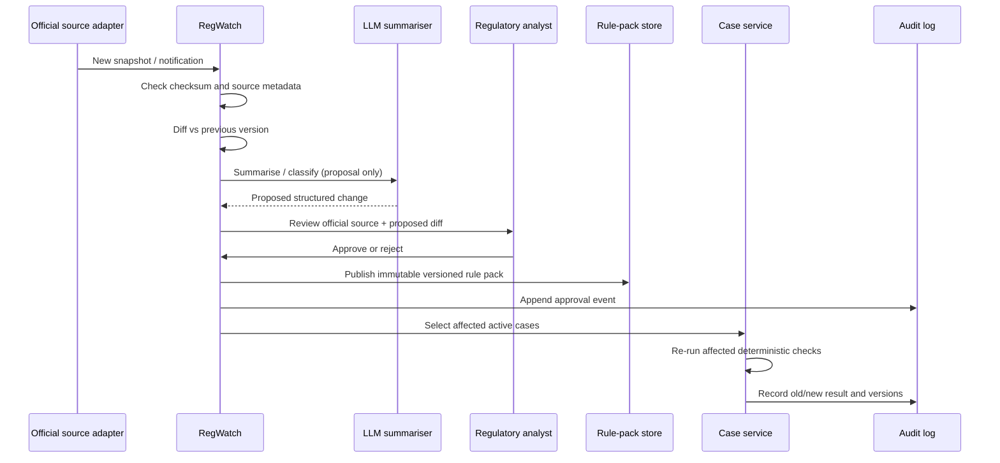

### 9.4 Source adapter contract

```python
class SourceAdapter(Protocol):
    source_id: str

    async def fetch(self) -> SourceSnapshot: ...
    def validate(self, snapshot: SourceSnapshot) -> ValidationResult: ...
    def diff(self, previous: SourceSnapshot | None, current: SourceSnapshot) -> list[SourceChange]: ...
```

Adapter implementations must not write directly to rule packs. They produce evidence and diffs only.

### 9.5 LLM role in RegWatch

The LLM may:

- Summarise official notices.
- Classify likely jurisdiction/regime.
- Extract candidate dates, references and HS codes.
- Draft a proposed JSON change.

The LLM may **not**:

- Publish a rule pack.
- Determine legal applicability without human review.
- Remove records from sanctions data.
- Trigger production blocking action.

### 9.6 Replay selection

Re-run only affected cases:

- A sanctions update → cases containing matching party/vessel countries/names and all in-flight cases under policy window.
- An HS-code rule change → cases containing that HS code/goods category.
- A price reference update → in-flight cases for mapped commodities.

Each replay stores prior and new results. Do not overwrite history.

### 9.7 Hackathon implementation slice

- Two actual adapters: OFAC snapshot diff and DGFT notification event.
- One seeded event: a cached official-style event if live access is unreliable.
- Manual approval button with explicit source document, summary, proposed diff and effective date.
- One deterministic replay that flips a synthetic in-flight case from green to amber.
- Remaining jurisdictions visible in source registry as `PLANNED` / `MONITORED_MANUALLY`, never falsely shown as live.

### 9.8 Acceptance checkpoints

| Checkpoint | Pass condition | Owner |
|---|---|---|
| P3-C1 — Source versioning | Same source snapshot cannot create duplicate event; checksum differs for true update | Ansh |
| P3-C2 — Approval gate | No proposed change reaches active rule pack without regulatory-analyst approval | Abhishek + QA |
| P3-C3 — Immutable decision history | Original case result remains queryable after replay | Ansh |
| P3-C4 — Targeted replay | Change only reruns cases in defined affected set | Ansh |
| P3-C5 — Demo event | Approval visibly changes one seeded case and audit log records versions | Abhishek + QA |

---

## 10. API Design

### 10.1 Principles

- Version all external APIs under `/api/v1`.
- Idempotency keys for state-changing endpoints.
- Pydantic request/response models; no untyped dictionaries at module boundaries.
- Correlation ID propagated into logs, jobs and audit events.
- No client-side direct call to LLM/reference-data services.
- RBAC checks server-side even if hackathon UI uses role simulation.

### 10.2 Initial endpoint surface

| Method | Endpoint | Purpose |
|---|---|---|
| `POST` | `/api/v1/cases` | Create case and upload documents |
| `GET` | `/api/v1/cases` | Paginated queue with filters |
| `GET` | `/api/v1/cases/{case_id}` | Full evidence workbench payload |
| `POST` | `/api/v1/cases/{case_id}/actions` | Maker/checker decision action |
| `POST` | `/api/v1/cases/{case_id}/reprocess` | Controlled reprocess/replay |
| `GET` | `/api/v1/rule-packs` | Rule pack versions |
| `GET` | `/api/v1/regwatch/events` | RegWatch event queue |
| `POST` | `/api/v1/regwatch/events/{event_id}/approve` | Approve proposed rule/data update |
| `GET` | `/api/v1/sources` | Source registry and freshness |
| `GET` | `/api/v1/kpis` | Aggregated operational metrics |
| `GET` | `/healthz` | Liveness |
| `GET` | `/readyz` | Readiness: DB/data snapshot availability |

### 10.3 Error response contract

```json
{
  "error": {
    "code": "REFERENCE_DATA_UNAVAILABLE",
    "message": "OFAC snapshot is unavailable for this run; sanctions check was not passed.",
    "correlation_id": "…",
    "retryable": false
  }
}
```

---

## 11. UI/UX Requirements

### 11.1 Screens

1. **Compliance workbench queue:** risk route, SLA, assigned analyst, source freshness, case status.
2. **Case review:** original documents left; extracted facts, discrepancies and evidence right.
3. **Entity-resolution drawer:** submitted party, candidate legal entities, match dimensions, confidence and action.
4. **Screening evidence drawer:** source snapshots, aliases, candidate match details, policy outcome.
5. **Decision panel:** maker/checker action; comment required for overrides.
6. **Audit timeline:** every extraction, rule result, decision, RegWatch replay and version.
7. **RegWatch workbench:** source health, events, official document, proposed rule diff, approval/reject controls.
8. **KPI page:** STP candidate rate, review reasons, decision time; use only synthetic/demo metrics.

### 11.2 UX safety requirements

- Red must never mean “guilty”; use “High-risk review required.”
- Every result offers source/evidence and recommended action.
- Show “data unavailable” distinctly from “passed.”
- Show snapshot timestamps and rule-pack versions in review view.
- Require typed rationale for analyst override.
- Display synthetic/reference-data labels.
- Avoid claims such as “fraud detected”; say “TBML risk indicator” or “discrepancy.”

---

## 12. Security, Reliability and Observability

### 12.1 Hackathon baseline controls

- Validate MIME type, magic bytes, file sizes and PDF page count.
- Hash uploads and outputs with SHA-256.
- Store API keys only in `.env`; never log or commit secrets.
- Use CORS allowlist for deployed frontend origin.
- Use parameterised SQLAlchemy queries.
- Disable debug/error stack traces to unauthenticated clients.
- Sanitize log content: never log raw complete documents or API keys.
- Rate-limit upload and expensive reprocess endpoints if time permits.
- Pin dependencies and run `pip-audit` / `npm audit` if available.

### 12.2 Availability behavior

| Dependency failure | Safe behavior |
|---|---|
| LLM unavailable | Use valid cached result for known hash; otherwise route to extraction review |
| GLEIF unavailable | Show registry check as `DATA_UNAVAILABLE`; do not verify entity |
| Sanctions refresh unavailable | Use last known snapshot with conspicuous freshness timestamp; policy may block processing if stale |
| Price data unavailable | `DATA_UNAVAILABLE`; skip no rule silently |
| Database unavailable | Readiness fails; no decisions accepted |
| RegWatch adapter error | Record source health degradation; retain current active rule pack |

### 12.3 Observability

- JSON structured logs: timestamp, level, correlation ID, case ID, component, rule ID.
- Audit log is business evidence; operational logs are separate.
- Minimal metrics: upload count, processing duration, extraction errors, source freshness, rule failures, replay count.
- Health endpoints distinguish liveness from readiness.

---

## 13. Testing Strategy

### 13.1 Test pyramid

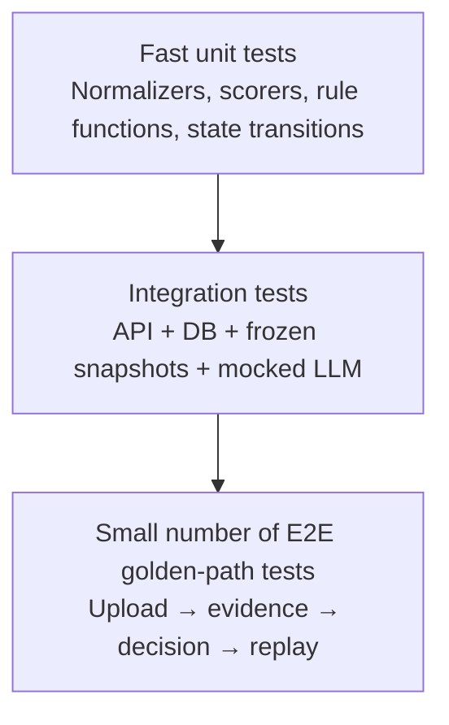

### 13.2 Test data categories

| Dataset | Purpose |
|---|---|
| Clean trade case | Ensure rules do not over-flag |
| Over-invoicing case | Validate price calculation and explanation |
| Under-invoicing case | Validate inverse scenario |
| Quantity mismatch case | Invoice vs BoL discrepancy |
| Similar-name case | `Amit TRD Co.` → manual review, never verified |
| Sanctions candidate case | Potential match terminology and evidence |
| Duplicate presentation | Reused invoice / BoL fingerprint |
| Missing-data case | `DATA_UNAVAILABLE`, no false pass |
| Malformed PDF | Safe failure |
| RegWatch replay case | Active case risk changes after approved update |

### 13.3 Quality gates

A commit cannot be considered integrated unless:

```text
Backend: ruff check . && mypy app && pytest -q
Frontend: pnpm lint && pnpm typecheck && pnpm test
E2E: golden flow succeeds on the staging build
QA: regression checklist signed in issue/PR comment
```

For the hackathon, if time is constrained, enforce at minimum: lint, unit tests for changed module, one golden smoke run, and QA sign-off.

### 13.4 QA Engineer mandate

The QA engineer is independent of the feature implementer and tests every merged increment.

**After each pull request / merge:**

1. Pull the exact commit SHA.
2. Run automated checks.
3. Run affected feature test fixtures.
4. Run the golden path smoke test.
5. Attempt failure cases: missing data, malformed upload, API timeout/mock, wrong role transition.
6. Verify no changed result loses evidence, version, or audit entry.
7. File reproducible bugs with severity and evidence.
8. Mark release candidate `PASS`, `CONDITIONAL PASS`, or `BLOCKED`.

### 13.5 Defect severity

| Severity | Meaning | Response |
|---|---|---|
| S0 | Unsafe automated approval, data leak, loss/corruption of audit evidence | Stop demo branch; rollback immediately |
| S1 | Core golden path broken, incorrect compliance result, state-machine bypass | Fix before next merge/demo |
| S2 | Significant feature degraded with workaround | Fix or feature-flag before freeze |
| S3 | Cosmetic / non-critical defect | Log; fix if buffer permits |

---

## 14. Multi-Agent Development Operating Model

### 14.1 Team responsibilities

| Person | Primary ownership | Secondary ownership |
|---|---|---|
| Ansh | Backend modular monolith, extraction pipeline, entity resolution, screening, rule engine, RegWatch ingestion/replay | Infra, deployments, API contracts |
| Abhishek | Next.js workbench, case UX, maker-checker, audit UI, RegWatch UX, pitch/demo integration | Rule-pack content, product acceptance |
| QA Engineer | Test harness, fixtures, regression suite, staging smoke, release sign-off | Security/edge-case review |
| Cursor agents | Scoped implementation, tests, docs, refactors only under human review | Never autonomous merge/deploy/secret access |

### 14.2 Cursor agent roles

Do not run broad, overlapping agents. Use one scoped agent per work item.

| Agent role | Allowed task | Required output |
|---|---|---|
| `backend-builder` | One bounded FastAPI module / endpoint | Code + unit tests + changed-files list |
| `frontend-builder` | One bounded UI component/screen against typed mock | Code + component test + screenshots if available |
| `test-author` | Generate fixture/negative tests for a specified contract | Tests only; no production changes |
| `reviewer` | Read diff for contract/security/risk regressions | Findings, no automatic modifications |
| `docs-agent` | Update API/schema/runbook docs | Documentation diff only |

### 14.3 Agent prompt contract

Every Cursor task must include:

```text
Context: Read tradepulse-system-design.md and applicable ADRs first.
Scope: [one bounded feature].
Do not modify files outside: [explicit paths].
Constraints: typed models; no direct LLM calls from UI; no unsafe fallbacks;
all check outputs follow RuleResult contract.
Tests: add/modify tests proving [acceptance criteria].
Stop condition: do not commit, deploy, alter secrets, or expand scope.
Return: changed files, commands run, tests passed/failed, assumptions, and risks.
```

### 14.4 Agent safety rules

- Humans review diffs before commit.
- Agents never receive production credentials.
- Agents cannot approve PRs, rule changes, or deployment.
- One agent owns a file/module at a time; declare file locks in task issue.
- Do not ask an agent to “build the whole app.”
- Start every task from an up-to-date branch and a clean working tree.

---

## 15. Git, Branching and Rollback Protocol

### 15.1 Branch model

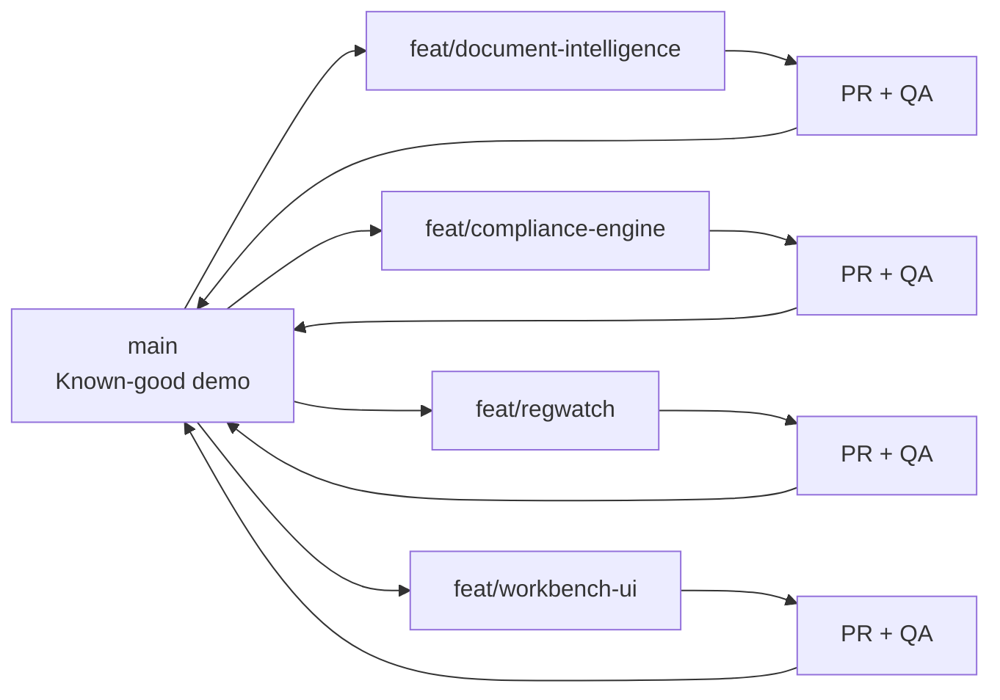

- `main` is always deployable and is the only demo branch.
- Use short-lived `feat/<scope>` branches.
- Never directly push to `main` after the initial repository skeleton.
- Tag each accepted checkpoint: `v0.1-skeleton`, `v0.2-doc-intel`, `v0.3-compliance`, `v0.4-regwatch`, `v0.5-demo-freeze`.
- Keep a `demo-safe` tag pointing to the last fully rehearsed build.

### 15.2 Commit rules

Commits must be small, reversible and meaningful:

```text
feat(doc-intel): validate invoice extraction schema
feat(screening): add versioned OFAC snapshot matcher
test(entity): cover ambiguous Amit TRD candidate
fix(workflow): prevent checker approval before maker signoff
docs(regwatch): add source adapter runbook
```

Never commit:

- `.env`, API keys, downloaded restricted data, customer-like sensitive PDFs.
- Unreviewed generated code spanning unrelated modules.
- A feature without tests when it touches policy, state transitions or audit evidence.

### 15.3 Checkpoint commit sequence

| Tag | What must work | Rollback value |
|---|---|---|
| `v0.1-skeleton` | UI shell, health endpoint, DB migration, mock case | Minimum pitch fallback |
| `v0.2-doc-intel` | Upload, extraction, schema validation, cached hero docs | Functional document demo |
| `v0.3-compliance` | Rule packs, price/consistency/entity screening, maker-checker | Core value demo |
| `v0.4-regwatch` | Event approval, versioned pack, targeted replay | Differentiator demo |
| `v0.5-demo-freeze` | Full golden path ×3, offline/cache fallback | Presentation build |

### 15.4 Rollback procedure

1. **Stop feature work.** Announce current failing commit SHA in team channel.
2. **Identify last known-good tag** (`git tag --sort=-creatordate`).
3. **Create a recovery branch** from the tag; do not destructively rewrite `main` during a hackathon.
4. Deploy recovery branch or reset staging to tag.
5. QA runs golden smoke test.
6. Log root cause as an issue; only reintroduce code through a fresh, scoped branch.

```bash
# Safe recovery example
git fetch --tags
git switch -c recovery/demo-safe v0.5-demo-freeze
# deploy this branch / point staging at this commit
```

---

## 16. Engineering Phases and Exit Criteria

### Phase 0 — Foundation and contracts

**Goal:** Running shell and unambiguous contracts before feature work.

- Monorepo setup: `apps/web`, `apps/api`, `packages/contracts`, `data/fixtures`, `docs`.
- Pinned Python/Node versions; `.env.example`; lint/test scripts.
- SQLAlchemy schema/migrations; typed OpenAPI client or shared TypeScript types.
- Mock JSON and static fixture documents.
- CI checks locally and in GitHub.

**Exit criteria:** A user can open the workbench, view seeded mock case, API health passes, and CI/lint are green.

**Tag:** `v0.1-skeleton`.

### Phase 1 — Document intelligence

**Goal:** Uploaded synthetic document → valid extracted facts with source evidence.

**Exit criteria:** P1 checkpoints pass; cache fallback works; UI renders hero documents and field evidence.

**Tag:** `v0.2-doc-intel`.

### Phase 2 — Compliance decision engine

**Goal:** Evidence-backed checks and controlled workflow.

**Exit criteria:** P2 checkpoints pass; no route bypasses maker-checker; all results expose data/rule versions.

**Tag:** `v0.3-compliance`.

### Phase 3 — RegWatch

**Goal:** Authoritative update → human-approved version → selective replay → preserved history.

**Exit criteria:** P3 checkpoints pass; no automatic rule publish; demo replay works from a seeded case.

**Tag:** `v0.4-regwatch`.

### Phase 4 — Hardening and demo freeze

**Goal:** Stable, honest, rehearsed prototype.

- Remove dead UI, error states verified, source labels accurate.
- Warm cache; run with network disabled.
- Record demo backup video.
- Run 3 consecutive complete golden paths.

**Exit criteria:** QA signs `PASS`; `demo-safe` tag exists; pitch claims match implementation.

**Tag:** `v0.5-demo-freeze`.

---

## 17. 22-Hour Hackathon Execution Plan

### Before 2:00 PM (allowed preparation; no pre-built repository)

- Keep architecture documents, schemas, fixture specification, source URLs and team runbook outside a pre-built code repository.
- Ensure laptops have Python, Node, Docker, Git, Cursor, API accounts and local dependencies installed.
- Download permitted public snapshots / source references and create synthetic-data specifications; do not create a prohibited pre-built codebase.
- Confirm the event’s exact rule interpretation with organisers if uncertain.

### H0–H2: bootstrap

- Create clean repository at start time; first commit is skeleton.
- Ansh: API/DB/health/contracts.
- Abhishek: UI shell + typed mock workbench.
- QA: test scaffold, fixture directory, smoke checklist.
- **Checkpoint:** `v0.1-skeleton` deployed/staged.

### H2–H6: Document intelligence

- Ansh: upload/quarantine, extraction adapter, schema validation/cache.
- Abhishek: split-screen documents, field/evidence cards.
- QA: malformed PDFs, schema failures, hero document tests.
- **Checkpoint:** `v0.2-doc-intel`.

### H6–H11: Compliance engine

- Ansh: normalisation, GLEIF adapter, local screening, rules/score output.
- Abhishek: discrepancies, entity-candidate UI, maker-checker controls.
- QA: ambiguity, sanctions candidate, missing-data, state-machine negative tests.
- **Checkpoint:** `v0.3-compliance`.

### H11–H15: RegWatch + audit

- Ansh: snapshots, diff/event, version pack, targeted replay.
- Abhishek: RegWatch event/review UI, audit timeline.
- QA: approval gate and replay-history tests.
- **Checkpoint:** `v0.4-regwatch`.

### H15–H18: integration and reliability

- Integrate only accepted modules.
- Fix S0/S1/S2 bugs; no unplanned capabilities.
- Warm cache and test network-off route.
- **Checkpoint:** golden path twice.

### H18–H20: demo freeze

- Freeze features; only fixes approved by both engineers and QA.
- Cut `v0.5-demo-freeze` and `demo-safe`.
- Record backup demo, screenshots and architecture diagram.

### H20–H22: pitch and buffer

- Rehearse 3-minute demo and Q&A.
- One engineer drives, one narrates/handles fallback, QA watches live behavior.
- Preserve one hour for recovery only.

---

## 18. Definition of Done

A feature is done only when all are true:

- Scope maps to an approved acceptance checkpoint.
- Typed API/schema contracts updated.
- Success and failure paths implemented.
- Relevant unit/integration tests pass.
- Evidence, source/version metadata and audit behavior are preserved where applicable.
- UI states distinguish pass, review, failure and unavailable data.
- QA tested the exact merge commit and signed off.
- Commit is reversible and release tag remains intact.
- Documentation/prompt context is updated if architecture changed.

---

## 19. Architecture Decision Records (ADRs)

Maintain short ADRs in `docs/adr/` whenever a choice affects safety, data, or scale.

### ADR-001: Modular monolith for hackathon

**Decision:** One FastAPI application with domain modules, one Next.js app.  
**Reason:** Reduces deployment and distributed-system failure modes in 22 hours.  
**Consequence:** Clear interfaces allow later extraction; no premature microservices.

### ADR-002: LLMs only for document extraction and proposal

**Decision:** LLM results are validated structured candidates; deterministic code makes decisions.  
**Reason:** Explainability, reproducibility and safety.  
**Consequence:** More explicit schemas/rules; fewer impressive-but-unsafe autonomous claims.

### ADR-003: Local versioned reference snapshots

**Decision:** Screening uses locally stored snapshots for each run.  
**Reason:** Reproducibility, offline resilience, clear evidence.  
**Consequence:** Need freshness monitoring and production ingestion operations.

### ADR-004: Human approval for RegWatch deployments

**Decision:** Regulatory change proposals require a human analyst.  
**Reason:** Legal interpretation cannot be delegated to an LLM.  
**Consequence:** Slower but safe, credible workflow.

### ADR-005: Fuzzy match is a review signal, not identity proof

**Decision:** No automatic verification/adverse outcome from name similarity alone.  
**Reason:** Prevent false positives/negatives and unsafe compliance claims.  
**Consequence:** Invest in evidence display and manual-review workflow.

---

## 20. Demo Claims: Approved Wording

| Do say | Do not say |
|---|---|
| “Decision-support prototype for human compliance review.” | “Our AI approves transactions.” |
| “Potential sanctions match requiring review.” | “This company is sanctioned.” |
| “TBML price anomaly indicator.” | “We detected fraud.” |
| “Uses versioned public reference-data snapshots in this prototype.” | “We are live-connected to every global registry.” |
| “Synthetic trade documents; public sources are cited and timestamped.” | “This is real bank data.” |
| “Rule changes require analyst approval before replay.” | “AI automatically updates regulations.” |

---

## 21. Final Release Checklist

### Functional

- [ ] Clean, over-invoiced, quantity mismatch, similar-name and sanctions-candidate cases render correctly.
- [ ] Evidence panel links every major discrepancy to facts, source and rule version.
- [ ] Maker/checker transitions enforce role/order.
- [ ] RegWatch event requires approval and replay preserves old/new history.
- [ ] Cached demo path works without external network.

### Safety and honesty

- [ ] All documents/cases are synthetic and labelled.
- [ ] Public source names/URLs/timestamps shown accurately.
- [ ] No fuzzy match is presented as confirmed identity/sanction.
- [ ] Data-unavailable paths are visible.
- [ ] No secrets committed or printed.

### Reliability

- [ ] `demo-safe` is tagged and verified.
- [ ] QA has signed the final commit SHA.
- [ ] A backup demo video exists locally.
- [ ] One engineer can run recovery steps without the other.
- [ ] Pitch deck statements match what runs.

---

## Appendix A — Suggested Repository Layout

```text
tradepulse/
├── tradepulse-system-design.md
├── README.md
├── .env.example
├── .gitignore
├── apps/
│   ├── api/
│   │   ├── app/
│   │   │   ├── api/
│   │   │   ├── domain/          # case, document, rules, regwatch
│   │   │   ├── services/        # extraction, entity, screening, replay
│   │   │   ├── adapters/        # gleif, source snapshots, llm
│   │   │   ├── repositories/
│   │   │   └── main.py
│   │   └── tests/
│   └── web/
│       ├── app/
│       ├── components/
│       ├── lib/
│       └── tests/
├── packages/
│   └── contracts/               # OpenAPI/shared types, rule JSON schemas
├── data/
│   ├── fixtures/                # synthetic only
│   ├── snapshots/               # gitignored / metadata committed
│   └── reference/
├── docs/
│   ├── adr/
│   ├── runbooks/
│   └── source-registry.md
└── scripts/
    ├── seed_demo.py
    ├── load_snapshots.py
    └── verify_golden_path.sh
```

## Appendix B — Required Runbooks

- `docs/runbooks/local-development.md`
- `docs/runbooks/demo-recovery.md`
- `docs/runbooks/reference-data-refresh.md`
- `docs/runbooks/qa-regression.md`
- `docs/runbooks/incident-and-rollback.md`

---

## Closing Engineering Principle

TradePulse earns trust not by claiming that its AI is infallible, but by making every uncertainty visible: the original document, the extracted field, the registry candidate, the data snapshot, the rule version, the calculation, and the accountable human decision.
